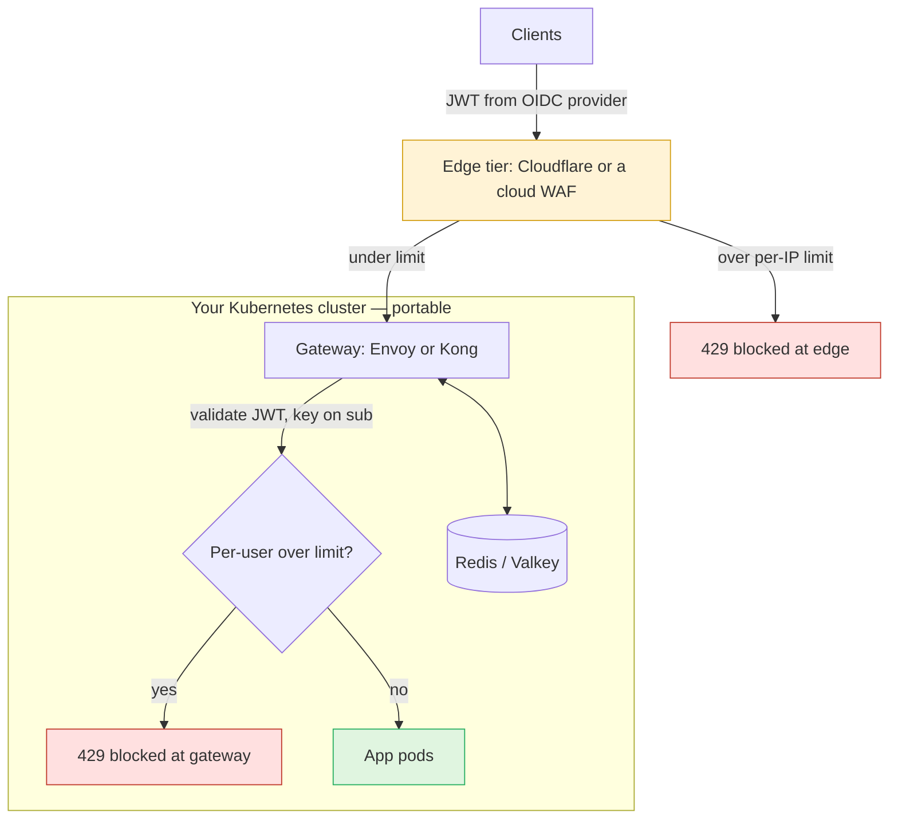
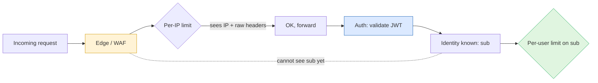
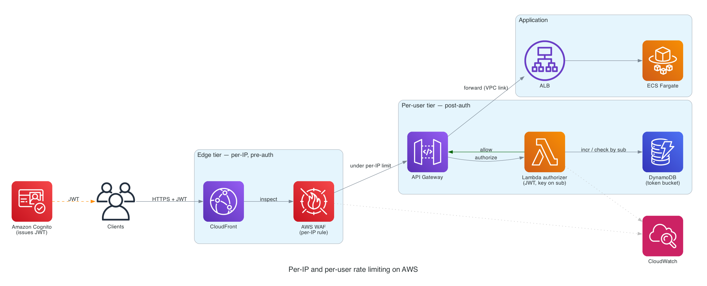

A while back I wrote about getting rate limited _by_ an external API. This post is the other side of that coin: how we, a scaling startup, rate limit the traffic hitting **our own** API — and how we built it so that switching cloud providers later would be a change of _implementation_, not a redesign.

When you are small you don't think about rate limiting at all. Then one of three things happens. A misbehaving client gets stuck in a retry loop and hammers an endpoint thousands of times a minute. A scraper discovers your public search endpoint and decides to mirror your catalogue. Or someone points a credential-stuffing script at your login route. The symptom is always the same: a flood your autoscaler dutifully tries to serve, a bill that creeps up, and real users getting a degraded experience.

Here's what changed recently, and why I think this moved from a nice-to-have to table stakes: **the traffic isn't human anymore.** For most of the web's history a single user generated sporadic, bursty, fundamentally _slow_ load — someone clicks, reads, thinks, clicks again. A human simply can't issue more than a handful of requests a minute by hand. LLM-based agents broke that assumption overnight. One user now points an agent at your API that calls it in a tight programmatic loop, retries aggressively on every hiccup, fans out into parallel sub-tasks, and runs unattended for hours. Per-user load jumped from a few requests a minute to hundreds, sustained, around the clock — and a single over-eager or buggy agent is indistinguishable from an attack.

That matters more than it used to because of where the cost lands. Every request an agent makes can cascade into _metered_ spend downstream: more compute, more database load, and increasingly your own LLM/inference bill if the endpoint itself calls a model. An unbounded agent isn't just a latency problem anymore — it's a **budget** problem that can quietly run up a five-figure cloud bill overnight, on legitimate credentials, with nobody doing anything malicious. In the agent era, per-user rate limiting is the ceiling you put on that blast radius. It's no longer about stopping bad actors; it's about keeping a well-meaning automated client from accidentally bankrupting a feature.

The naive fix is to add a middleware in the app: check a counter, return a `429`. It works, but it has two problems I learned the hard way. First, by the time your app counts the request, **you have already paid for it** — the connection was accepted, routed, a container woke up, auth ran. Second, and worse: your app containers are a _fixed, slow-to-scale_ resource. During a real flood, the existing containers get bombarded and fall over their health checks long before new ones finish spinning up. The layer doing the rejecting is the layer that dies.

So we don't reject in the app. We reject in two tiers _in front_ of it.

## The principle: fix the architecture, swap the implementation

The trick to staying cloud-agnostic isn't finding one magic tool that runs everywhere. It's keeping the **layers and their responsibilities constant**, and letting only the _implementation_ of each layer vary per cloud. Anything that speaks a standard protocol travels with you; anything that's a proprietary cloud API is a chain to that vendor.

There are two tiers, and they exist for a non-obvious reason explained below:

1. **Edge tier** — coarse, per-IP, pre-authentication. Sheds floods cheaply before they reach your stack.
2. **Per-user tier** — precise, keyed on a stable user id, post-authentication. Runs in an elastic gate _in front of_ your app so the app fleet never absorbs the surge.



## Why per-user can't live at the edge

This is the insight that shaped the whole design. Your first instinct (it was mine) is: authenticate the user, figure out who they are, and rate-limit per user right there at the edge. You can't — and the reason is ordering.

**The edge security layer always runs before authentication.** On AWS, "WAF rules are evaluated before other access control features, such as resource policies, IAM policies, Lambda authorizers, and Amazon Cognito authorizers." The same is true of edge WAFs generally and of CloudFront's own functions. So at the moment the edge evaluates a request, **the user's identity does not exist yet** — auth happens later, downstream. The edge can only key on what the _client_ sends unprompted: the source IP, and raw headers/cookies/query values it has no way to validate.



So the edge tier does what it _can_ do well — limit by IP — and the per-user tier lives after auth, where the identity is actually known.

## Tier 1: the edge (per-IP, pre-auth)

This is the layer that sheds dumb floods. Every cloud has a managed WAF (AWS WAF, GCP Cloud Armor, Azure Front Door) and they're all roughly equivalent in capability — which also makes them the easiest lock-in to fall into. To keep this tier independent of your _compute_ cloud, the cleanest move is an edge provider that sits in front of any origin: **Cloudflare**, Fastly, or Akamai. Your origin can be on AWS today and GCP next year; the edge config doesn't move.

A per-IP rate limit on Cloudflare, in Terraform:

```hcl
resource "cloudflare_ruleset" "edge_rate_limit" {
  zone_id = var.zone_id
  name    = "edge-ip-rate-limit"
  kind    = "zone"
  phase   = "http_ratelimit"

  rules {
    action      = "block"
    description = "Per-IP limit on the API"
    expression  = "(http.request.uri.path contains \"/api/\")"

    ratelimit {
      characteristics     = ["ip.src", "cf.colo.id"]
      period              = 60
      requests_per_period = 2000
      mitigation_timeout  = 60
    }
  }
}
```

Two things worth knowing regardless of provider: roll new limits out in **count/log mode** first and watch the metrics for a few days — your legitimate power users get closer to the threshold than you'd guess — and **scope the rule down** to the paths that need it instead of one global limit. Volumetric L3/L4 DDoS is the one thing you genuinely can't self-host economically, which is the honest reason this tier stays a vendor: just pick one independent of your compute.

## Tier 2: per-user (keyed on `sub`, post-auth, in front of the app)

After authentication you finally have a stable identifier for the user. Use the **`sub` claim** from the JWT your identity provider issues — not the raw token, which rotates on every refresh and would hand each user a fresh bucket. The identity provider itself is portable as long as it speaks OIDC: self-host **Keycloak** or **Zitadel**, or use a managed-but-neutral issuer. Your gateway only ever reads a standard claim.

The enforcement point is a gateway that runs as containers in your own cluster — **Envoy** or **Kong** — sitting in front of your app pods. This is what solves the bombardment problem: the gateway scales horizontally as its own deployment (HPA), so _it_ absorbs a surge, not your fixed app fleet. The app pods only ever see traffic that already passed the limit.

Kong is the low-ops option — its JWT and rate-limiting plugins do this out of the box, with shared state in Redis/Valkey so the limit is correct across all gateway replicas:

```yaml
services:
  - name: api
    url: http://app.default.svc:8080
    routes:
      - name: api-route
        paths: ["/api"]
    plugins:
      - name: jwt # validates the JWT, resolves the consumer from it
      - name: rate-limiting
        config:
          minute: 300 # per authenticated user
          limit_by: consumer # the consumer is the authenticated identity (sub)
          policy: redis # shared state → correct across all gateway replicas
          redis:
            host: redis.default.svc
            port: 6379
          fault_tolerant: true
```

Envoy is the more powerful option: its `jwt_authn` filter validates the token and extracts the `sub` claim, and its rate-limit filter sends a descriptor keyed on that claim to the open-source `ratelimit` service, which holds the token buckets in Redis. More wiring, but it's the gold standard for distributed rate limiting at scale. Either way, **the state lives in Redis/Valkey**, which speaks the same protocol on every cloud — swapping ElastiCache → MemoryStore → Azure Cache is a connection-string change, not an architecture change.

> **Landing this on AWS specifically:** the same shape maps to AWS WAF (tier 1) + a Lambda authorizer that validates the JWT and does a token-bucket check in DynamoDB before the request reaches your integration (tier 2). It works and it's fully serverless — just know that API Gateway caches authorizer results, so you must set `authorizerResultTtlInSeconds = 0` or the counter won't increment on cached requests. The catch is it's the _most_ locked-in version: Lambda authorizer + DynamoDB don't travel to another cloud. The Envoy/Kong + Redis version is the same architecture without the chain.



The two tiers map straight onto AWS services: CloudFront + WAF shed per-IP floods at the edge, and the Lambda authorizer — keyed on the Cognito `sub` and backed by a DynamoDB token bucket — does the per-user limiting before a request ever reaches Fargate. Notice the authorizer scales per-request, so it absorbs a surge instead of your app fleet.

## The portability map

The whole point is that switching clouds touches the right-hand column, never the architecture:

| Layer            | Responsibility                  | Portable choice           | The lock-in version  |
| ---------------- | ------------------------------- | ------------------------- | -------------------- |
| Edge             | Per-IP, flood/DDoS, pre-auth    | Cloudflare / Fastly       | AWS WAF, Cloud Armor |
| Identity         | Issue JWT with stable `sub`     | Keycloak / Zitadel (OIDC) | Cognito              |
| Per-user gate    | Limit on `sub`, in front of app | Envoy / Kong (in k8s)     | Lambda authorizer    |
| Rate-limit state | Shared counters                 | Redis / Valkey            | DynamoDB             |
| Compute          | Run the stack                   | Kubernetes                | ECS/Fargate          |
| Observability    | Metrics on both tiers           | OpenTelemetry             | CloudWatch           |
| Infra-as-code    | Provision it all                | Terraform/OpenTofu        | CDK                  |

## The trade-off, stated honestly

Portability is not free — you pay for it in operations. Managed WAF, Cognito, Lambda, and DynamoDB are close to zero-ops; Envoy, Redis, and Keycloak are yours to run, patch, and scale. For a three-person team that is a real cost, and "use the managed AWS version and abstract it behind Terraform modules" is a perfectly defensible choice if you don't actually expect to move. What you should _not_ do is bury cloud-specific assumptions in your request-handling logic, because that's the thing that turns a cloud migration from a config change into a rewrite.

The way I think about it: the edge is the bouncer that keeps the stampede out, the gateway is the doorman who checks each guest's pass, and the app is the host inside — free to focus on guests who actually made it in. Keep those three roles fixed and well-separated, let each one be played by whatever the current cloud offers, and you get a disproportionate amount of resilience _and_ the freedom to move — for not much more than a couple of config files and the discipline to keep the layers honest.

And in a world where your "guests" are increasingly tireless automated agents rather than humans who pause to think, that doorman checking each pass is no longer a luxury. It's the difference between an agent-driven feature that scales and one that wakes you up to a budget alert at 3am.
