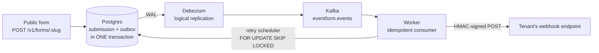
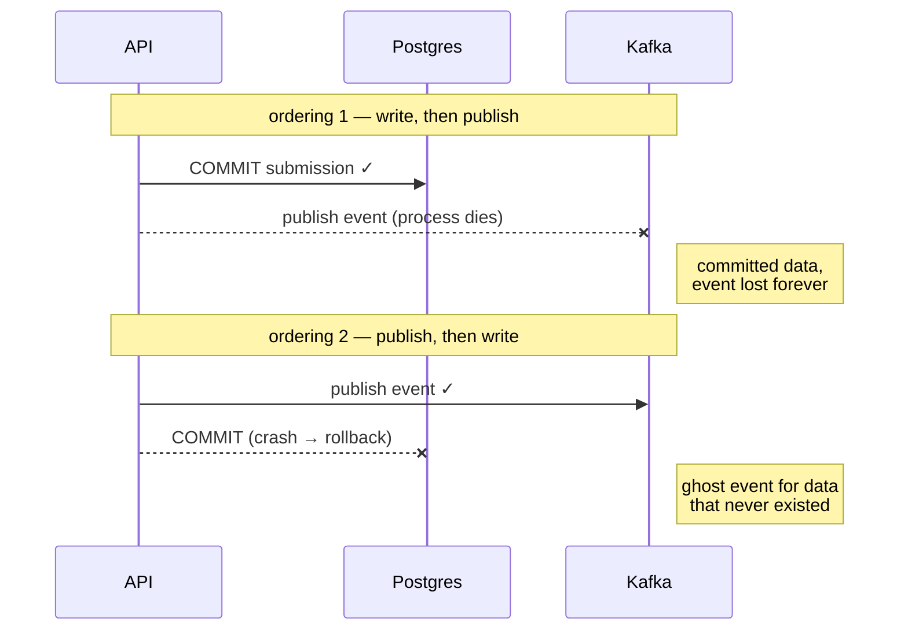
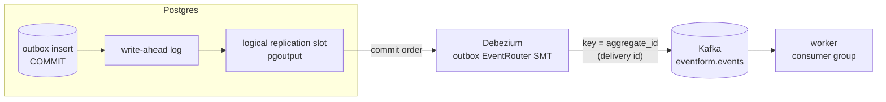
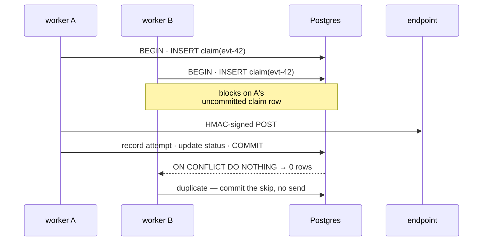
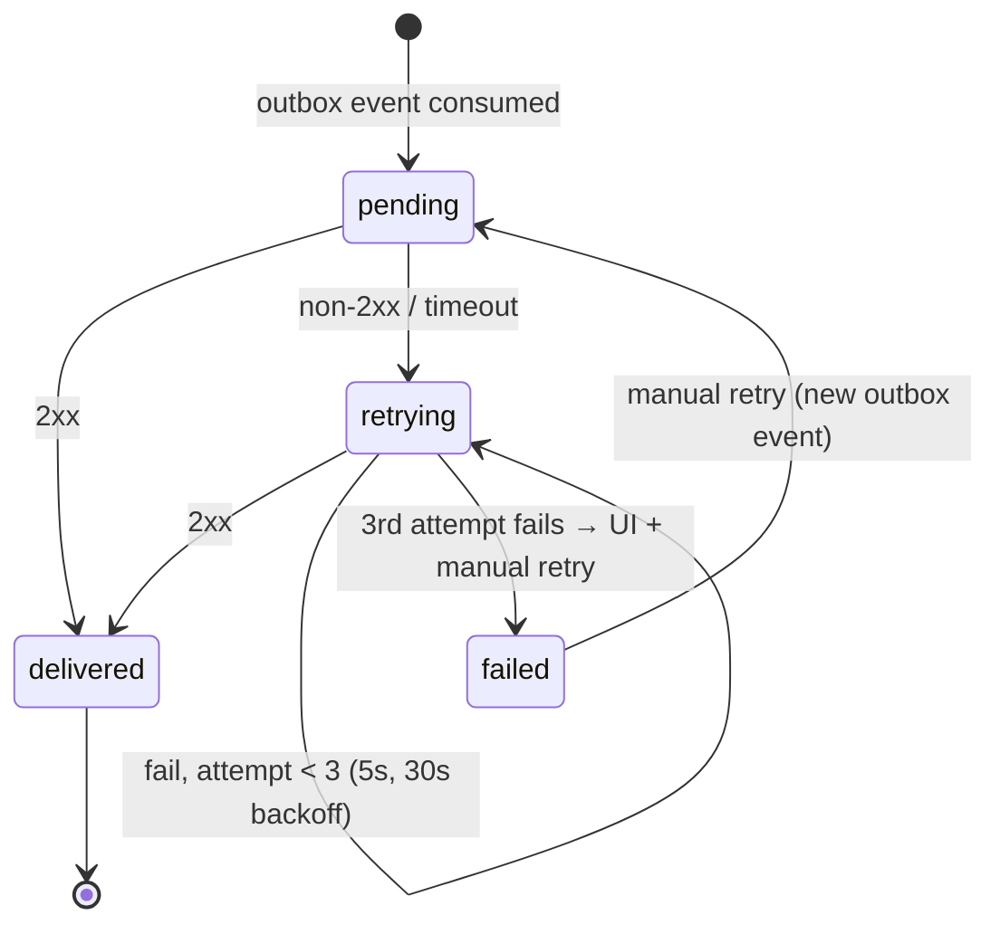
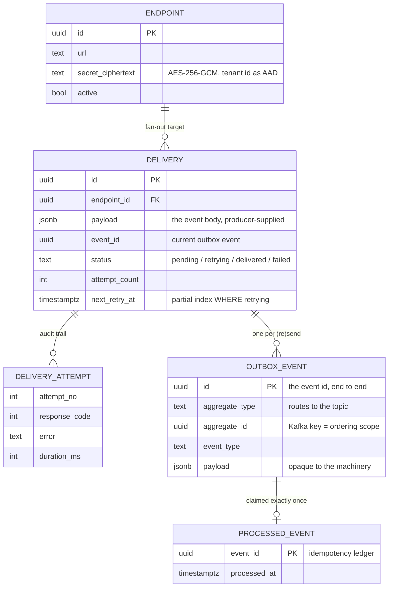
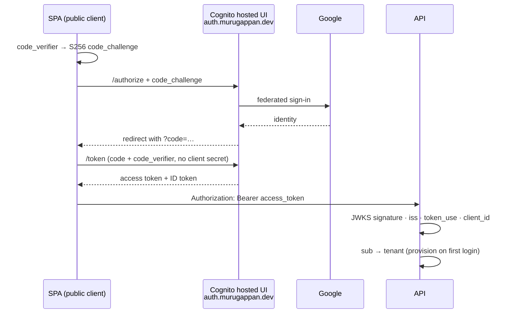

I wanted a portfolio project that wasn't another todo app. Something anyone could actually click around in, built on the event-driven patterns I keep getting asked about in system design interviews. So I built [EventForm](https://eventform.murugappan.dev) ([source](https://github.com/murugu-21/eventform)) — a mini-Typeform where every form submission fans out to webhook endpoints through a transactional outbox, Debezium CDC, Kafka, and an idempotent consumer. The whole thing runs as a docker-compose stack on a single small AWS box, with Postgres on managed Neon and Cognito handling auth. I built it with Claude Code doing most of the typing, which was its own learning experience.

## The architecture



Someone submits a form. The API writes the submission, a `deliveries` row for each active endpoint, and an `outbox` row for each delivery, all in **one Postgres transaction**. Debezium tails the write-ahead log and pushes outbox inserts into a Kafka topic. A NestJS worker consumes them and delivers HMAC-signed webhooks. Failed deliveries retry with backoff and eventually show up in a UI with a manual retry button.

The "Kafka" here is actually Redpanda — a single-process, Kafka-API-compatible broker with no JVM. On a 2 GB box that footprint matters, and kafkajs and Debezium can't tell it apart from Apache Kafka. Everywhere I say Kafka below, I mean the wire protocol, not the JVM.

## Avoiding the dual write

My first instinct years ago would have been to write the submission to Postgres and then publish an event to Kafka. The problem is what happens when the process dies between those two writes. You either lose the event or you publish an event for data that never committed. You can reorder the writes, wrap things in try/catch, add a reconciliation cron — none of it actually closes the window, it just moves it around. Both orderings fail, just in opposite directions:



The transactional outbox pattern gets rid of the second write entirely. The event **is** a database row, committed in the same transaction as the data it describes:

```text
BEGIN;
INSERT INTO submissions  (...);          -- the data
INSERT INTO deliveries   (...);          -- one per active endpoint
INSERT INTO outbox       (id, payload);  -- the event, id = event id
COMMIT;                                  -- all or nothing
```

There is no publish step to forget and no second system to fail. During review we actually tested this by revoking INSERT on the outbox table mid-request — the whole submission rolled back, no partial state anywhere.

## CDC with Debezium

Something still has to move outbox rows into Kafka. The tempting answer is a poller, but polling adds latency and has its own missed-row edge cases. Change Data Capture reads the write-ahead log instead. Debezium connects to Postgres as a logical replication client, sees every committed outbox insert in commit order, and its outbox event router strips the envelope and produces just the payload to `eventform.events`. Messages are keyed by delivery ID, so all attempts for one delivery land in the same partition, in order.



A few config choices do quiet work here. `pgoutput` is Postgres's built-in logical decoding plugin, so nothing gets installed into the database. `snapshot.mode=no_data` starts the connector streaming from the current WAL position instead of dumping the table first — old outbox rows are history, not events to re-deliver. And the slot's confirmed position only advances after Kafka acknowledges the write, so a connector crash replays from the last confirmed LSN: at-least-once into Kafka, the same contract the rest of the pipeline already lives with.

The thing that surprised me when I traced the failure scenarios: the replication slot makes Postgres itself the durability buffer. Postgres will not recycle WAL segments that the slot hasn't confirmed. So if Kafka goes down for an hour, nothing is lost — submissions keep succeeding, WAL accumulates, and Debezium replays everything once Kafka is back. Kafka is just transport here; the database stays the source of truth. The flip side is that a multi-day outage will pin WAL until your disk fills, so in real production you monitor slot lag.

## Exactly once\* (at least once)

The worker commits Kafka offsets only after it finishes processing, so the same message can be redelivered after a crash, a rebalance, or a deploy. To make redelivery safe, the worker claims each event in a ledger table, and the placement of that claim is the part worth remembering — it's the **first statement of the same transaction that does the work**:

```sql
INSERT INTO processed_events (event_id) VALUES ($1)
ON CONFLICT DO NOTHING RETURNING event_id;
-- zero rows back = duplicate = skip without sending
```

Because the claim and the work commit or roll back together, they can never disagree. When two workers race on the same event, the second one blocks on the first's uncommitted insert and then sees the conflict, so exactly one webhook goes out. We tested that with two concurrent processors against a slow endpoint. The race, drawn out:



This is the textbook reason the claim must be an `INSERT` and not a `SELECT`-then-`INSERT`: the row-level lock on the uncommitted insert is what serialises the two workers. A read-check would let both proceed.

There is one boundary I can't engineer away. The HTTP send happens inside the transaction, so if the process dies between the send and the commit, the claim rolls back and the redelivery sends the webhook again. You can't atomically commit a database transaction and an external HTTP call. So the honest description is at-least-once delivery with idempotent processing, and every webhook carries an `X-Eventform-Event-Id` header so receivers can dedupe. Stripe and GitHub offer the same contract. The landing page says "Exactly once\* (at least once)" and I mean both halves of it.

Retries follow the same philosophy. The auto-retry (5s, 30s, then dead) and the manual retry button don't get their own delivery mechanism — they insert a new outbox row and go through the same pipeline again. One delivery path, one set of invariants. The retry scheduler claims due rows with `FOR UPDATE SKIP LOCKED`, which means I could run multiple workers without any distributed lock machinery — two workers polling the same table simply grab disjoint rows. The poll itself is cheap because of a partial index, `ON deliveries (next_retry_at) WHERE status = 'retrying'`, so it scans an index that only ever contains the in-flight retry set, not the whole table.

The full lifecycle of a delivery:



Every transition is written by the same transaction that does the work, and every attempt — success or failure — leaves a `delivery_attempts` row with the response code, error and latency, which is what the deliveries UI renders.

## Bigger than a PoC: events as a platform concern

EventForm is a proof of concept, but the shape of it is a drop-in answer for any business that wants to emit events to its customers — the Stripe/GitHub/Shopify webhook model. The part I'd sell to a platform team is the separation of concerns it buys you.

Backend developers integrating with this pipeline have exactly one job: keep writing your application state, and add an outbox insert to the same transaction. That's it. One extra INSERT. They never touch Kafka, never think about retries or backoff, never learn what HMAC is, never get paged because a customer's endpoint has been returning 503 for an hour. Their failure domain ends at COMMIT.

Everything downstream — CDC, the topic, the idempotent consumer, signing, retry scheduling, the failed-deliveries UI — is platform machinery built once and shared by every event type. Adding a new event to the catalogue is a payload schema and an outbox insert, not a new delivery system. And because the database is the buffer, producers don't slow down or fail when consumers are down: the slowest customer endpoint in the world can't back-pressure a form submission.

Here is the delivery half of the schema on its own — the part a platform team would lift. There is no foreign key back into the domain at all. The producer hands the machinery a payload at creation time, durable on the delivery row, and from that point on the pipeline owns only the envelope:



The payload is opaque to everything downstream: the machinery reads and rewrites exactly two envelope fields it owns — `eventId` and `attempt` — when it re-emits, and never interprets the rest. Retries, manual or scheduled, spread the stored payload into a fresh outbox row with a new envelope; no joins back into producer tables, ever. That's what makes it liftable: a payments team and a forms team could share this delivery system without it knowing either domain exists.

It didn't start out this clean. The first version kept a `submission_id` foreign key on deliveries and rebuilt the payload by joining `submissions` and `forms` on every retry — which worked, but meant the "generic" machinery secretly understood forms. Writing this section is what made me notice, and the fix (store the payload, drop the FK) deleted more code than it added: the retry scheduler lost its joins, and its tests no longer need to seed a single domain table.

## Handing off auth instead of owning it

This thing lives on the open internet. The moment a domain resolves, scanners and credential-stuffing bots show up — that's not paranoia, it's the baseline weather. So authentication on every tenant-facing route isn't a feature, it's table stakes, and I didn't want to own the risky parts of it: passwords, sessions, token lifecycles. Auth is delegated to Cognito federating Google, over plain OAuth 2.0:



The SPA runs the authorization-code + PKCE flow against Cognito's hosted UI (on a branded `auth.` subdomain). PKCE means the SPA is a public client with no embedded secret. The API never sees a password and keeps no session state — it verifies the JWT's signature against Cognito's JWKS using `jose`, checks the issuer, `token_use` and client ID, and that's the entire trust decision. A tenant gets provisioned on first login from the token's `sub` claim, and the display name comes from the ID token after the code exchange, since the access token deliberately carries no profile data.

I put the verification behind a small `TokenVerifier` interface so local development uses a dev-token implementation and production uses the Cognito one. Everything downstream — the guard, tenant resolution, RLS — is identical in both modes, which made the production cutover a config change rather than a code change.

If I had to summarise it for an interview: authentication is the IdP's job, and my application's job reduces to verifying signatures and mapping `sub` to a tenant.

The one surface that can't be authenticated is the public form itself — anyone with the link should be able to submit, that's the product. The same open-internet reasoning applies there, just with a different tool: per-IP rate limiting on the submission endpoint, so a bot hammering a form link exhausts its own budget instead of flooding the pipeline with junk submissions and webhook fan-out.

## Letting Postgres enforce tenant isolation

Every tenant-scoped query runs inside a transaction that starts with `SET LOCAL app.tenant_id = $1`, and Postgres row-level security policies do the filtering. The API connects as a non-superuser role, so even if application code forgets a WHERE clause, the database refuses to return another tenant's rows.

Two RLS gotchas cost me real debugging time, and both pass every happy-path test:

1. After a transaction-local `set_config` commits, the session value on a pooled connection becomes an **empty string**, not NULL. So `current_setting(...)::uuid` throws on the next anonymous query that reuses the connection. Every policy needs `NULLIF(current_setting('app.tenant_id', true), '')::uuid`.
2. Permissive policies OR together. My "anonymous users can read published forms" policy quietly leaked other tenants' published forms into logged-in sessions, because RLS takes the union of matching policies. It needed an explicit "only when no tenant is set" condition.

## Webhook integrity

Every delivery is signed with `HMAC-SHA256(secret, timestamp + "." + body)`, sent as an `X-Eventform-Signature` header. The timestamp is bound into the MAC so receivers can reject replays outside a tolerance window, and comparison is constant-time. Review caught a real bug here: `Number(timestamp)` accepts decimals, which let a signature minted for one timestamp/body split verify against a shifted one. The fix was a strict digits-only parse — a one-line change I would never have caught myself.

The signing secrets are never stored in plaintext. Each one is encrypted with AES-256-GCM, the tenant ID bound in as additional authenticated data, so a ciphertext copied onto another tenant's row simply fails to decrypt. That gives me cryptographic tenant isolation on top of RLS. The cipher sits behind a small `SecretCipher` seam: today it's an in-process AES-256-GCM implementation keyed from a 32-byte secret in the environment, and swapping in a managed, HSM-backed KMS (AWS KMS, Vault) for audited, rotatable keys is a one-class change with nothing above the seam touched.

## Scaling to zero between visitors

A portfolio demo that nobody is looking at most of the time shouldn't cost what a server running around the clock costs. So the box powers itself off when idle and wakes on the next visit. An on-box timer watches for real traffic — every non-health request stamps a timestamp on disk — and after 30 minutes of silence the instance sets its own Auto Scaling group to zero and terminates itself. Nothing is lost when it does: Postgres lives on Neon, and the only on-box state is the Redpanda log, which is disposable. That's the durability property from the CDC section paying off again — because the database is the source of truth and the replication slot replays anything in flight on the next boot, the compute is genuinely throwaway.

Waking back up is the half with a visible cost. The SPA is static on Cloudflare Pages, so the site itself never goes down; it just notices the API is unreachable and POSTs to a small authenticated endpoint (API Gateway → Lambda → desired capacity 1) that launches a fresh box. The honest price is a cold start — the first visitor after an idle stretch waits two to three minutes while the instance boots, pulls ~3 GB of images, and starts the pipeline. So instead of a spinner that looks broken, I show them what's actually happening and why, with a live progress estimate. It runs for a few dollars a month this way, which is the difference between leaving a demo up indefinitely and taking it down to save money.

## What working with Claude actually looked like

The workflow that worked for me: I described what I wanted, Claude interviewed me about the design — tenancy model, retry semantics, where row locks actually applied — wrote a spec, and broke the build into five phased plans. Each plan task went to a fresh agent, and every task got reviewed twice: once for "did you build what the plan said", once for quality, with reviewers that poke at the running system instead of just reading the diff.

That review loop earned its cost many times over. Besides the HMAC and RLS bugs above, it caught the worker crash-looping on a fresh deployment (the Kafka topic doesn't exist until the first event is ever produced, and the consumer's metadata fetch threw — a bug that only shows up on day one in production), and it caught CI booting the entire stack but never running migrations, so every test was hitting an empty database.

### The slop tax

The failures were as instructive as the wins. AI agents generate confident nonsense at a low but very real rate, and in my experience it concentrates in prose rather than code. My landing page claimed "5 retries" when the code does 3. The hero badge said "Phase 4 demo" — internal planning jargon that leaked straight into customer-facing copy. The best one: the webhook-secret modal told users "shown once — store it now" while the Reveal button right next to it would happily decrypt the secret on demand, forever. That's copy written for a hash-only security model, pasted onto a system that was deliberately built reveal-capable.

The pattern I took away is that automated review verifies behaviour relentlessly and skips words entirely. The tests proved the retry logic worked; nothing ever fact-checked the marketing claim against `MAX_ATTEMPTS = 3`. Once I noticed, one dedicated audit pass — find every factual claim in the UI and verify it against the code — cleaned everything up in a single sweep. If you ship AI-built products, budget for that pass. The code lies rarely. The copy lies fluently.

### What I'd keep doing

Tests against real services made the whole thing trustworthy — every integration test hits live Postgres and Kafka and runs the real AES-256-GCM cipher, no mocks anywhere, so when an agent claimed something worked there was a green suite against real infrastructure behind the claim. Plans written as executable documents (exact file paths, actual code blocks) kept agents on rails, and deviations got reported instead of silently improvised. And I kept the design decisions for myself — outbox over dual-write, Cognito over hand-rolled auth — and spent most of my attention being suspicious of everything else.

Final tally: 163 tests, a Playwright run that drives sign-in → build → publish → anonymous submit → delivered webhook end to end, and a pipeline whose delivery guarantees I can defend line by line. The robots type fast; you just have to read what they wrote.
