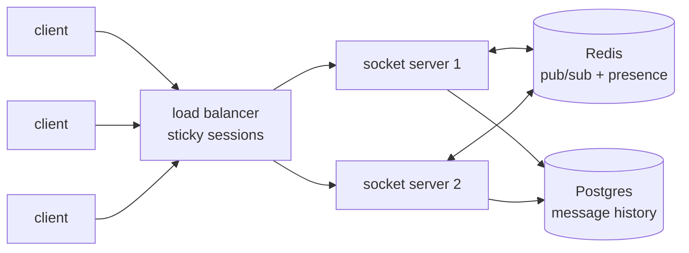
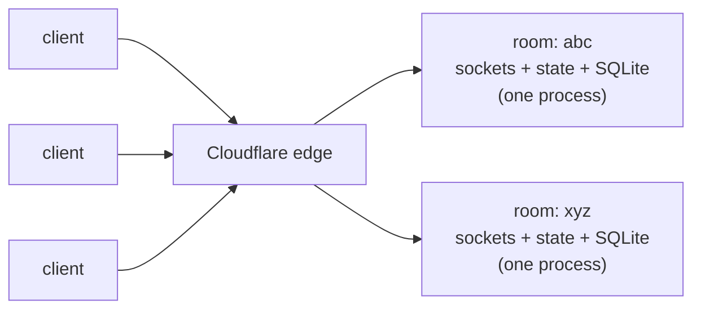
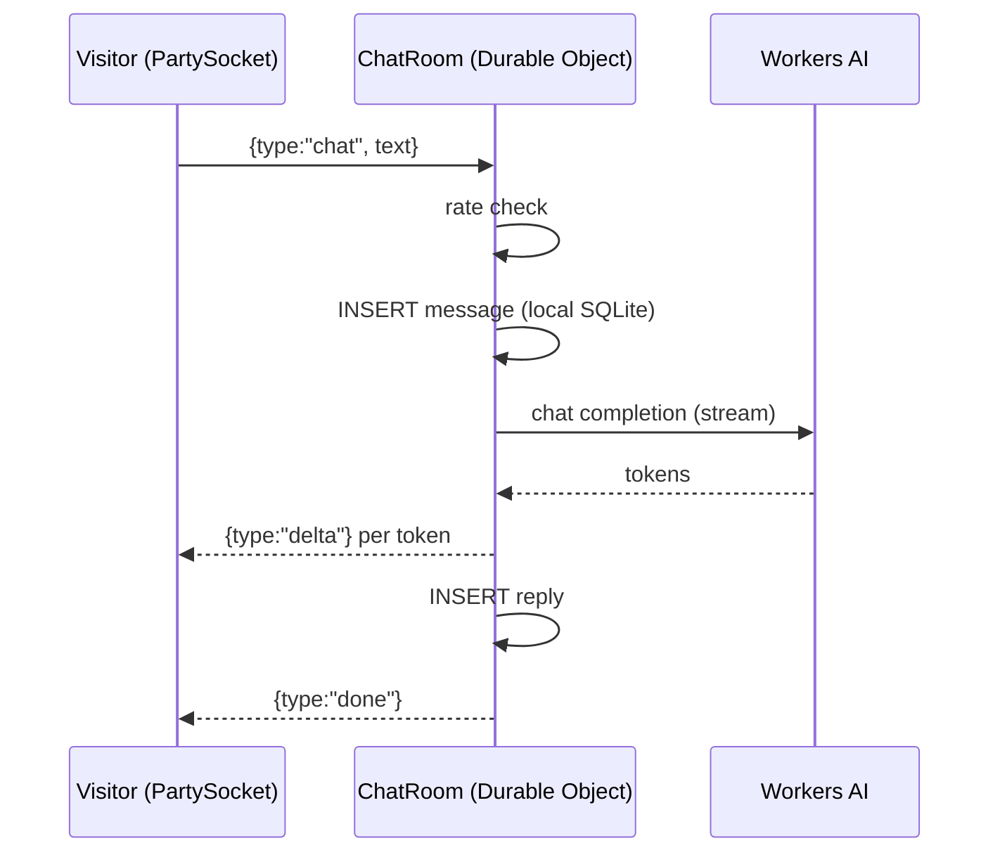

[SiteGPT](https://sitegpt.ai)'s founder [Bhanu Teja](https://x.com/pbteja1998) spent months trying to solve a realtime sync problem. His product — a chatbot trained on your website — needed something deceptively hard: when the bot gets stuck, a **human agent should be able to join the same conversation, live**. Visitor, bot, and agent, all seeing the same messages at the same time. Classic multiplayer.

His testimonial on [partykit.io](https://www.partykit.io/) tells the ending: he'd "tried everything and nothing seemed to work properly," until [Sunil Pai](https://x.com/threepointone) (PartyKit's creator, ex-React core) solved the entire problem **in around ten lines of code**.

Ten lines. After months. That gap is not a talent gap — it's an architecture gap. The ten lines knew something the months of work didn't: **a chat room isn't a routing problem, it's a place**. Give the room its own process, its own memory, and its own address, and most of the "hard realtime problems" stop existing.

I read that story, went down the rabbit hole, and ended up shipping the same architecture for the chatbot on this site. This post is what I learned: how the default socket.io + Redis stack actually works, what the room-as-a-process model replaces it with, real production code, real costs, and — because no architecture post should be a sales pitch — exactly where the old way is still the right way.

## The default stack, drawn honestly

If you ask for "scalable websocket chat" in a system design interview, you'll get some version of this:



And the canonical implementation:

```js
import { Server } from "socket.io"
import { createAdapter } from "@socket.io/redis-adapter"
import { createClient } from "redis"

const pub = createClient({ url: REDIS_URL })
const sub = pub.duplicate()
await Promise.all([pub.connect(), sub.connect()])

const io = new Server(httpServer, { adapter: createAdapter(pub, sub) })

io.on("connection", async (socket) => {
  const { roomId } = socket.handshake.query
  socket.join(roomId)

  // History lives in Postgres, presence in Redis, the socket on this box
  socket.emit("history", await db.messages.findMany({ where: { roomId } }))
  await pub.hSet(`presence:${roomId}`, socket.id, Date.now())

  socket.on("chat", async (text) => {
    await db.messages.create({ data: { roomId, text } }) // history → Postgres
    io.to(roomId).emit("chat", text) // fanout → Redis
    // presence, typing, receipts: same split, every feature
  })
})
```

Nothing here is wrong. But look at what you've actually built: **the state of one room is smeared across three systems**. The sockets live on whichever servers the load balancer picked. Presence lives in Redis. History lives in Postgres. Every feature — typing indicators, read receipts, rate limits, "agent joined the chat" — now spans at least two of them, and keeping them coordinated is your job: sticky sessions so reconnects land somewhere sane, pub/sub so server 1 can reach a socket on server 2, cleanup jobs for the presence hashes that leak when a server dies mid-connection.

You are, in effect, building a distributed system whose entire purpose is to *simulate* what a single machine per room would give you for free.

So... why not have a single machine per room?

## The inversion: the room is the server

That's the whole idea behind Cloudflare's Durable Objects, and behind PartyKit, which made the model ergonomic enough to go mainstream (PartyKit has since joined Cloudflare; its open-source successor library [partyserver](https://github.com/cloudflare/partykit/tree/main/packages/partyserver), maintained inside the PartyKit monorepo, is what this site uses).

A Durable Object is three guarantees stapled together:

1. **One instance, globally.** Ask for the object named `room-abc` from anywhere on Earth and you get *the same instance*. The room ID isn't a lookup key — it's the address. No sticky sessions, no session registry: routing is the platform's problem now.
2. **Single-threaded execution.** One room processes one message at a time. Redis has strong atomic primitives — `INCR` always was, and Redis 8.4 added compare-and-set variants of `SET` — but each is a specific primitive you design your logic *around*. Inside a room, arbitrary multi-step code — read, branch, write across SQL tables — is race-free exactly as written.
3. **Storage in the same process.** Each object gets its own private SQLite database, co-located with the compute. Reading history is a synchronous local query, not a network hop to a database that might disagree with your cache.



Compare the two diagrams. The second one didn't get simpler because I hid boxes — it got simpler because the boxes stopped needing to agree with each other. This is the actor model: state and behavior sealed inside a process that owns them, addressable by name. It's a forty-year-old idea. Erlang built a telecom empire on it; we'll come back to that.

## The production code

Everything below is trimmed from the actual worker running the "Chat with Jarvis" widget on this site ([full source on GitHub](https://github.com/murugu-21/murugu-21.github.io) — the whole backend, including the LLM plumbing, is about a thousand lines).

The room, using partyserver:

```ts
import { Server, type Connection } from "partyserver"

export class ChatRoom extends Server<Env> {
  static options = { hibernate: true }

  onStart() {
    // This room's private database. Not a schema shared with every room —
    // a whole SQLite file that belongs to this one conversation.
    this.ctx.storage.sql.exec(
      `CREATE TABLE IF NOT EXISTS messages (
         id INTEGER PRIMARY KEY AUTOINCREMENT,
         role TEXT NOT NULL,
         content TEXT NOT NULL,
         created_at INTEGER NOT NULL
       )`
    )
  }

  onConnect(connection: Connection) {
    // Reconnect, new tab, returning visitor — history is a local read.
    this.send(connection, { type: "history", messages: this.history() })
  }

  async onMessage(connection: Connection, raw: unknown) {
    const msg = parseClientMessage(raw)
    this.persist("user", msg.text)

    // Stream an LLM reply token-by-token down the same websocket
    const reply = await runModelExchange(this.env.AI, this.messages(), (delta) =>
      this.send(connection, { type: "delta", text: delta })
    )

    this.persist("assistant", reply.content)
    this.send(connection, { type: "done" })
  }
}
```

That's not pseudocode-shaped-like-the-real-thing; that *is* the real thing minus error handling and a few one-line helpers (`persist`, `history`, and `send` wrap SQL statements and `connection.send`). `onConnect` replays history with a synchronous local query. `onMessage` persists, streams, persists — and because the room is single-threaded, no interleaving between those steps is possible.

And the entire client-side session layer:

```ts
import { PartySocket } from "partysocket"

const socket = new PartySocket({
  host: window.location.host, // same Worker serves the static site
  party: "chat-room",
  room: roomId(), // a nanoid in localStorage. That's it. That's the session.
})

socket.send(JSON.stringify({ type: "chat", text }))
// PartySocket buffers sends while (re)connecting — no dropped messages
// during the connect window, no readyState bookkeeping in app code.
```

One message, end to end:



Notice what's *absent*: no session store, no pub/sub hop, no presence hashes leaking when a server dies holding open sockets, no "which server owns this socket" logic. The features that took a section each in the old architecture are single lines here, because the room is a place and everything the room needs is in the room.

## What "scalable" actually means here

The scaling story has a shape worth being precise about: **this model scales out by room count, not by room size.**

A million concurrent conversations means a million small, independent processes, spread across Cloudflare's fleet with no coordination between them — nothing shared, nothing to rebalance, no hot Redis channel. Scale-out is free in the dimension chat actually grows: more conversations.

Within one room, the ceiling is real: single-threaded execution means one very hot room is bounded by what one process can do, and the practical answer for enormous rooms is sharding them across several objects. For conversations, support chats, docs, lobbies — rooms measured in ones to thousands of participants — you will never feel it. For a 500k-viewer broadcast, this is the wrong primitive (more on that below).

The economics deserve honesty in both directions, because "serverless is cheap" is only half a sentence — it's cheap *at low and spiky utilization*, and you pay a premium per unit of compute for that elasticity. So here are actual monthly estimates, computed from Cloudflare's published rates (Workers Paid $5/mo base; requests $0.15/M with websocket messages billed 20:1; duration $12.50/M GB-s beyond 400k included; SQLite rows written $1.00/M beyond 50M included; storage $0.20/GB-month) against ballpark list prices for a VM stack (VMs, managed Redis, load balancer, managed Postgres). Assumptions: an AI chat like this site's — the room stays awake ~2 seconds per message at 128 MB while the LLM streams — and 2 database rows per message.

| Traffic | socket.io + Redis | Workers + Durable Objects | Difference |
| --- | --- | --- | --- |
| ~1k messages/day | ~$60 (2 small VMs $25, Redis $15, LB $10, Postgres $10) | **$0** — inside the free tier | **DO saves ~$60 (100%)** |
| ~100k messages/day | ~$60 — same floor, barely working | **~$10** ($5 base + ~$4 duration) | **DO saves ~$50 (~6× cheaper)** |
| ~1M messages/day | ~$150–200 — bigger VMs, bigger Redis, real Postgres | **~$105** ($89 duration + $10 rows + $5 base + misc) | **DO saves ~$50–90 (~40%)** |
| ~10M messages/day, sustained | ~$250–350 — 3–4 solid VMs, still linear-ish | **~$1,500** (duration ~$930 + rows written ~$550) | **VMs save ~$1,150+ (~5× cheaper)** |

Read the last column top to bottom and you can see the crossover happen — under these assumptions it sits just past a million messages a day. Two footnotes that move it: a plain human-relay chat (no LLM holding the room awake) cuts the DO duration bill by an order of magnitude, pushing the crossover much further out; and the VM column silently assumes somebody patches, scales, and does failover for four systems — price that ops time in and the crossover moves out again. Serverless converts a fixed cost plus an ops job into a linear per-use cost; past sustained heavy throughput, dedicated hardware wins on unit price — which is one reason WhatsApp runs its own Erlang fleet instead of renting actors by the GB-second.

| | socket.io + Redis | Workers + Durable Objects |
| --- | --- | --- |
| Idle / spiky traffic | full price, 24/7 | ~zero — `hibernate: true` parks idle rooms while the platform holds their sockets open |
| The hidden line item | ops time across four systems | vendor margin baked into unit prices |

## When socket.io + Redis is still the right answer

Here's the test I'd give a design interview candidate: **is your realtime problem a noun or a feed?**

Rooms, documents, auctions, game lobbies, device twins — *nouns*. A bounded set of clients interacting with a thing that has state. Nouns want actors.

Tickers, scoreboards, notification firehoses — *feeds*. Arbitrary subscription topology, or one identical stream to a huge audience. Feeds want brokers. Concretely, prefer the traditional stack when:

- **Subscription topology is a matrix, not a room.** A dashboard client subscribing to 50 instrument feeds at once is what pub/sub was born for; actor-per-ticker forces awkward fan-in.
- **One stream, hundreds of thousands of watchers.** A broadcast is N sends on the room's one thread — at some tens of thousands of sockets you'd be hand-building fanout trees. Stateless socket servers draining one Redis channel is the honest architecture there. (The hybrid is legitimate too: an actor as the source of truth *publishing into* a broadcast layer for spectators.)
- **You already run the infra.** A team fluent in Redis with a k8s estate and on-prem requirements should not adopt a new execution model to ship a chat widget.
- **Polyglot backends.** socket.io speaks every language; Durable Objects speak JavaScript on workerd.
- **Heavy CPU per message.** Workers have tight CPU budgets. A transcoding pipeline doesn't belong in a room actor.

And two Durable-Object-specific caveats that vendor posts skip: an object lives **where it was first created** — a room born in Chennai answers from (roughly) Chennai forever, which is perfect when participants are co-located and suboptimal when they're not; and the debugging/observability ecosystem is years younger than what a decade of socket.io + Redis operators built up.

## The vendor question — you're adopting a model, not a vendor

The uncomfortable question: isn't this just trading Redis for a deeper kind of Cloudflare lock-in?

Here's the reframe that settled it for me. What you're actually adopting is the **actor model** — and it's the single most battle-tested architecture in messaging history. WhatsApp runs on it right now: a cluster of Erlang nodes, every connection its own lightweight process with its own state, messages routed process-to-process with no external broker, roughly a million connections per server, two billion users today — and, famously, a team of about fifty engineers back when it crossed nine hundred million. That's the pedigree. Durable Objects didn't invent the pattern; they made it rentable by the millisecond.

One precision worth having before a commenter has it for you: WhatsApp's actor is the *connection* — a process per user, with group messages fanning out into per-recipient queues — while Durable Objects make the *room* the actor. Same model, different choice of boundary. Rooms suit the web-chat shape, where the conversation itself has shared state (history, presence, budgets); connection-actors suit per-recipient delivery guarantees at WhatsApp's scale. Knowing which boundary your problem wants *is* the design skill.

Because it's a model and not an API, the portable move is to keep your domain logic behind an interface the size of a postcard:

```ts
interface RoomActor {
  onConnect(conn: Conn): void
  onMessage(conn: Conn, data: unknown): Promise<void>
  broadcast(data: unknown, exclude?: string[]): void
  storage: RoomStorage // co-located, transactional, private to this room
}
```

Everything interesting in this site's chat — persistence, rate budgets, LLM streaming, lead capture — codes against those five surface areas. partyserver is today's binding. If tomorrow demanded a move: partyserver and workerd (the Workers runtime itself) are both open source and self-hostable, and the same interface maps almost mechanically onto an Elixir/Phoenix channel backed by a GenServer per room — the boring, decades-proven implementation of the same idea. The transport and the placement are the vendor's. The model is yours.

## The receipt

I didn't write this from a benchmark lab. The architecture in this post is the one running the chat widget in the corner of this page — a grounded LLM concierge with streamed replies, persistent per-visitor conversations, rate budgets, and email lead capture, built to production in a weekend, deployed with one command, running on the free tier.

Open the widget and say hi to Jarvis. You'll be talking to a Durable Object — one small, single-threaded room that owns everything it needs. Then go read [the source](https://github.com/murugu-21/murugu-21.github.io) and count the pieces of infrastructure you *didn't* have to deploy.

If your realtime problem is room-shaped, give each room its own process: you ship in days instead of months, run almost no infrastructure, and the actor model — not any one vendor — keeps the exit door open.
