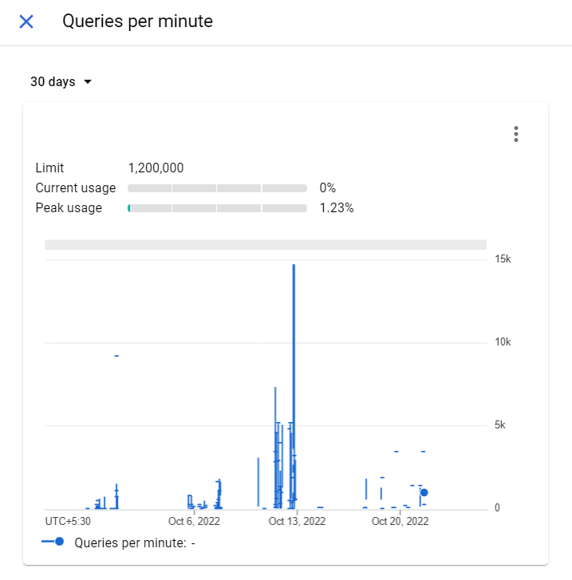

Recently, I was working on syncing contracts in a user's gmail inbox to our clm tool and when testing on my colleague's account, we hit a 429 status code from Google servers and it was working fine on my own Google account. The corresponding message for 429 was **Too Many Requests** My first instinct was to look at the API quota and, to my surprise, peak usage per **minute** was not even 2%.



On further digging, we found [this](https://developers.google.com/gmail/api/reference/quota) per user per second limit of 250 units per second with each request given a unit like get - 5, send - 100 and so on. The justification behind this painful limit is that Google does not want the user's servers to get overloaded and crash. This also avoids DoS attacks, I suppose, from malicious third parties. I would have put something similar in place if I had designed the system too.

Ok. This is a fairly standard design decision by Google, and the solution must be available across the internet, right? **No**, The solution is fairly simple in a multi-threaded language.

1. create 50 threads (50 \* 5 = 250).
2. make the request
3. put the threads to sleep for 1 second
4. Repeat till all resources are fetched

Alas!, Node is single-threaded and relies on asynchronous programming for network requests. Node has no native API to control the number of unresolved promises or pause execution for a given time. First, we looked at some npm packages and [p-limit](https://www.npmjs.com/package/p-limit) was the only one with enough weekly downloads to be worthy of consideration, but it had no support for debouncing in terms of time, only concurrent promises.

So, we ended up implementing the ideas in a blog post. I have given my understanding of his implementation and how we wrapped axios.get function in it. If you are interested, you can read more [here](https://blog.thoughtspile.tech/2018/07/07/rate-limit-promises/).

Since this is a complex problem with two paradigms (concurrency and time), let's try to implement debounce for a single function first. setTimeout is an old API and relies on callbacks rather than promises. Not ideal!. (you can await or use then with promises only) So, let's wrap it in a promise like below,

```js
new Promise(ok => setTimeout(ok, 1000))
```

We might need to change the time it awaits later or reuse it for another debounce with a different delay. So, let's use a closure to make the delay configurable.

```js
const resolveAfter = ms => new Promise(ok => setTimeout(ok, ms))
```

A new function call should now be made only after at least 1 second has passed since the previous function call. We have to make use of promise chaining to achieve this, as below.

```js
function rateLimit1(fn, msPerOp) {
  let wait = Promise.resolve()
  return (...a) => {
    // We use the queue tail in wait to start both the
    // next operation and the next delay
    const res = wait.then(() => fn(...a))
    wait = wait.then(() => resolveAfter(msPerOp))
    return res
  }
}
```

Now, for the first call, the wait is resolved, so it calls fn without delay and has a promise attached that resolves after 1 second. Now, if a second call is made concurrently by ,say, `Promise.all`, the function call will only be made after the last promise in the wait object resolves (setTimeout). This is repeated for each call.

Now we can wrap the promise and call with no worries, the operations
are magically delayed.

```js
const slowFetch = rateLimit1(axios.get, 1000)
Promise.all(urls.map(u => slowFetch(u, options)))
  .then(raw => Promise.all(raw.map(p => p.json())))
  .then(pages => console.log(pages))
```

Now we just need to use this debounce for 50 function calls instead of one. One approach would be to create 50 promise objects in a queue and chain a single timeout to them. The issue is that even if one of them resolves before 1 s, then the 51st request would go through the empty slot before it times out.

```js
rateLimit(concurrencyLimit(fetch, N), ms)
```

So, we have to do the reverse and create 50 resolveAfter's and put them in a circular queue so the 51st request waits for at least 1 second from the first request before executing.

```js
concurrencyLimit(rateLimit(fetch, ms), N)
```

Below code implements this

```js
function rateLimit(fn: Function, delayMs: number, maxConcurrent = 1) {
  // A battery of 1-rate-limiters
  const queue = Array.from({ length: maxConcurrent }, () =>
    rateLimit1(fn, delayMs)
  ) // Circular queue cursor
  let i = 0
  return (...a: any) => {
    // to enqueue, we move the cursor...
    i = (i + 1) % maxConcurrent // and return the rate-limited operation.
    return queue[i](...a)
  }
}
```

Now, we just need to replace `rateLimit1(axios.get, 1000)` with `rateLimit(axios.get, 1000, 49)`. I have left some leeway by using only 49 requests because a user opening Gmail app/website would also count as a request and shouldn't result in 429.

I hope you can use this idea to solve your rate limit problems in external services!!!!!!
