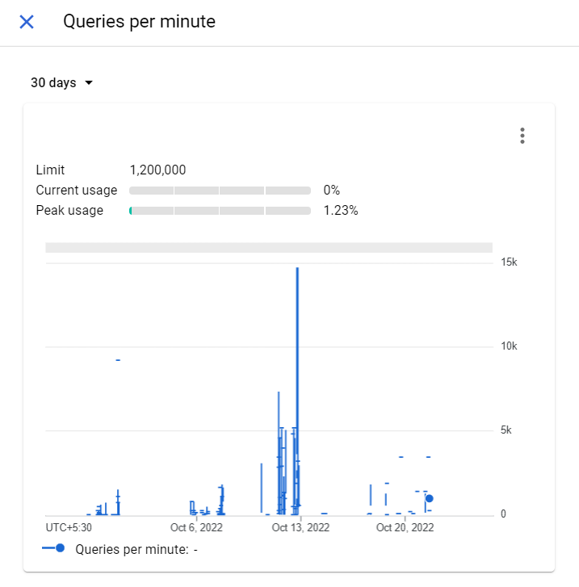

Recently, I was working on syncing contracts in a user's gmail inbox to our clm tool and when testing on my colleague's account, we hit a 429 status code from Google servers and it was working fine on my own Google account. The corresponding message for 429 was **Too Many Requests** My first instinct was to look at the API quota and, to my surprise, peak usage per **minute** was not even 2%.



On further digging, we found [this](https://developers.google.com/gmail/api/reference/quota) per user per second limit of 250 units per second with each request given a unit like get - 5, send - 100 and so on. The justification behind this painful limit is that Google does not want the user's servers to get overloaded and crash. This also avoids DoS attacks, I suppose, from malicious third parties. I would have put something similar in place if I had designed the system too.

Ok. This is a fairly standard design decision by Google, and the solution must be available across the internet, right? **No**, The solution is fairly simple in a multi-threaded language.

1. create 50 threads (50 \* 5 = 250).
2. make the request
3. put the threads to sleep for 1 second
4. Repeat till all resources are fetched

Alas!, Node is single-threaded and relies on asynchronous programming for network requests. Node has no native API to control the number of unresolved promises or pause execution for a given time. First, we looked at some npm packages and [p-limit](https://www.npmjs.com/package/p-limit) was the only one with enough weekly downloads to be worthy of consideration, but it had no support for debouncing in terms of time, only concurrent promises.

So, we ended up implementing the ideas in a blog post. I have given my understanding of his implementation and how we wrapped axios.get function in it. If you are interested, you can read more [here](https://blog.thoughtspile.tech/2018/07/07/rate-limit-promises/).

Since this is a complex problem with two paradigms (concurrency and time), let's try to implement debounce for a single function first. setTimeout is an old API and relies on callbacks rather than promises. Not ideal!. (you can await or use then with promises only) So, let's wrap it in a promise like below,

```js
new Promise(ok => setTimeout(ok, 1000))
```

We might need to change the time it awaits later or reuse it for another debounce with a different delay. So, let's use a closure to make the delay configurable.

```js
const resolveAfter = ms => new Promise(ok => setTimeout(ok, ms))
```

A new function call should now be made only after at least 1 second has passed since the previous function call. We have to make use of promise chaining to achieve this, as below.

```js
function rateLimit1(fn, msPerOp) {
  let wait = Promise.resolve()
  return (...a) => {
    // We use the queue tail in wait to start both the
    // next operation and the next delay
    const res = wait.then(() => fn(...a))
    wait = wait.then(() => resolveAfter(msPerOp))
    return res
  }
}
```

Now, for the first call, the wait is resolved, so it calls fn without delay and has a promise attached that resolves after 1 second. Now, if a second call is made concurrently by ,say, `Promise.all`, the function call will only be made after the last promise in the wait object resolves (setTimeout). This is repeated for each call.

Now we can wrap the promise and call with no worries, the operations
are magically delayed.

```js
const slowFetch = rateLimit1(axios.get, 1000)
Promise.all(urls.map(u => slowFetch(u, options)))
  .then(raw => Promise.all(raw.map(p => p.json())))
  .then(pages => console.log(pages))
```

Now we just need to use this debounce for 50 function calls instead of one. One approach would be to create 50 promise objects in a queue and chain a single timeout to them. The issue is that even if one of them resolves before 1 s, then the 51st request would go through the empty slot before it times out.

```js
rateLimit(concurrencyLimit(fetch, N), ms)
```

So, we have to do the reverse and create 50 resolveAfter's and put them in a circular queue so the 51st request waits for at least 1 second from the first request before executing.

```js
concurrencyLimit(rateLimit(fetch, ms), N)
```

Below code implements this

```js
function rateLimit(fn: Function, delayMs: number, maxConcurrent = 1) {
  // A battery of 1-rate-limiters
  const queue = Array.from({ length: maxConcurrent }, () =>
    rateLimit1(fn, delayMs)
  ) // Circular queue cursor
  let i = 0
  return (...a: any) => {
    // to enqueue, we move the cursor...
    i = (i + 1) % maxConcurrent // and return the rate-limited operation.
    return queue[i](...a)
  }
}
```

Now, we just need to replace `rateLimit1(axios.get, 1000)` with `rateLimit(axios.get, 1000, 49)`. I have left some leeway by using only 49 requests because a user opening Gmail app/website would also count as a request and shouldn't result in 429.

I hope you can use this idea to solve your rate limit problems in external services!!!!!! Published this as an npm package to make it easy for others to use, [read more here](https://www.npmjs.com/package/rate-limit-concurrent)

## Update, September 2026

Four years on, the circular queue above got replaced, and the reason was memory, not rate limits. It solves the throughput puzzle nicely, but look at how it is driven: `Promise.all(urls.map(slowFetch))` creates every promise up front, so with a big enough inbox the process holds every pending call and, as they resolve, every response, until the last one lands. How long that takes is not something you control either. Each call lives for its own response time plus the sleep chained behind it, so the number of results sitting in memory at any moment depends on how fast Google answers, and there is no knob that bounds it. On the cloud machines this runs on that meant one thing: process massive amounts of data and it dies with an out-of-memory error, part way through, with no record of what had already been synced. And because `Promise.all` rejects on the first failure, even a run that survived lost the whole batch on one bad request.

The version I use now is boring on purpose: slice the work into batches of 49, sleep for a second after each batch so the server gets breathing space, and write what succeeded and what failed to disk after every batch.

```js
import fs from "fs/promises"

const sleep = ms => new Promise(ok => setTimeout(ok, ms))
const readJson = async (file, fallback) => {
  try {
    return JSON.parse(await fs.readFile(file, "utf8"))
  } catch {
    return fallback
  }
}

const items = await readJson("data.json", [])
const done = new Set(await readJson("success.json", []))
const failures = []
const batchSize = 49

for (let i = 0; i < items.length; i += batchSize) {
  const batch = items.slice(i, i + batchSize).filter(item => !done.has(item.id))
  if (batch.length === 0) continue

  const results = await Promise.allSettled(batch.map(item => axios.get(url, { params: item })))
  results.forEach((result, j) => {
    if (result.status === "fulfilled") done.add(batch[j].id)
    else failures.push({ id: batch[j].id, reason: String(result.reason) })
  })
  await fs.writeFile("success.json", JSON.stringify([...done], null, 2))
  await fs.writeFile("failure.json", JSON.stringify(failures, null, 2))

  // Breathing space for the server: a full second with nothing in flight
  // before the next 49 go out.
  await sleep(1000)
}
```

Why this beats the rate limiter for a backfill:

- **Memory is bounded, and you pick the bound.** At most 49 requests and 49 responses exist at any moment, and each batch is processed and dropped before the next one is created. The high-water mark is `batchSize`, whatever the response times do and however large `data.json` is. That is the property the queue could not offer.
- **It resumes.** If the process still dies at item 4,000 of 10,000, the next run skips the 4,000 in `success.json` and carries on. The old version started from zero every time and re-spent quota on work already done.
- **Failures are data, not exceptions.** `Promise.allSettled` lets one bad item fail without taking the other 48 with it, and `failure.json` tells you which id failed and why. Rerunning the script retries exactly those, because they never made it into the success set.
- **The ceiling is hard.** The sliding window in the circular queue is correct, but it depends on timers lining up. Here a batch has to finish and then the process sleeps a full second before the next one starts, so the worst case is 49 requests in any one-second window, whichever way Google counts.
- **No cleverness.** One loop, one sleep, two files. Nothing to explain to the next person who reads it.

The trade-off is throughput: a batch is only as fast as its slowest request, and the sleep on top of it is dead time, so this makes fewer requests per minute than the queue when responses are quick. For a sync that runs once and has to finish, I will take slower and resumable every time. The [npm package](https://www.npmjs.com/package/rate-limit-concurrent) is still the right tool when the requests arrive continuously and you cannot batch them.

### Going distributed

The batch loop above is one process on one machine. Once the sync runs as a service, the same idea moves into Postgres: the table is the queue, `SELECT … FOR UPDATE SKIP LOCKED` hands each row to exactly one worker, and the sleep at the end of every job is what turns "N workers" into "at most N requests per second", however many pods those workers are spread across.

```sql
create table jobs (
  id         bigserial primary key,
  payload    jsonb not null,
  status     text not null default 'pending', -- pending | done | failed
  attempts   int not null default 0,
  last_error text,
  updated_at timestamptz not null default now()
);
create index jobs_pending on jobs (id) where status = 'pending';
```

Enqueue is one insert; `data.json` from before becomes rows.

```sql
insert into jobs (payload) select * from jsonb_array_elements($1::jsonb);
```

Each worker claims one row inside a transaction, does the request, records the outcome, sleeps, and only then commits.

```js
import pg from "pg"

const pool = new pg.Pool({ connectionString: process.env.DATABASE_URL })
const sleep = ms => new Promise(ok => setTimeout(ok, ms))
// Workers per process times replicas must stay at or below 49.
const WORKERS = Number(process.env.WORKERS ?? 7)
const MAX_ATTEMPTS = 3

async function worker() {
  const client = await pool.connect()
  try {
    for (;;) {
      await client.query("begin")
      const { rows } = await client.query(
        `select id, payload from jobs
         where status = 'pending'
         order by id
         for update skip locked
         limit 1`,
      )
      if (rows.length === 0) {
        await client.query("commit")
        return
      }
      const job = rows[0]
      try {
        await axios.get(url, { params: job.payload })
        await client.query("update jobs set status = 'done', updated_at = now() where id = $1", [
          job.id,
        ])
      } catch (err) {
        await client.query(
          `update jobs
           set attempts = attempts + 1,
               status = case when attempts + 1 >= $2 then 'failed' else 'pending' end,
               last_error = $3,
               updated_at = now()
           where id = $1`,
          [job.id, MAX_ATTEMPTS, String(err)],
        )
      }
      // The job is not over until the worker has rested: one request per
      // worker per second, so the fleet never exceeds WORKERS × replicas.
      await sleep(1000)
      await client.query("commit")
    }
  } finally {
    client.release()
  }
}

await Promise.all(Array.from({ length: WORKERS }, worker))
```

Three details carry the whole design:

- **The lock is the lease.** The row stays locked from `select` to `commit`. A worker that dies mid-request rolls back, the row is `pending` again and the next `SKIP LOCKED` picks it up. No heartbeat table, no visibility timeout, no stuck "running" state to sweep.
- **Concurrency is a deploy setting, not code.** Seven workers per pod and seven replicas is 49 consumers; scale the deployment and the ceiling moves with it. `SKIP LOCKED` is what makes that safe: two pods can never claim the same row, so adding a pod adds throughput without adding duplicates.
- **The sleep sits inside the job.** Because a worker holds its row for at least a second, the fleet-wide rate is bounded by the number of workers, exactly like the circular queue at the top of this post, but enforced by the database rather than by timers inside one process.

Failures and retries fall out of the schema. A failed request bumps `attempts`, keeps the row `pending` up to three tries, then parks it as `failed` with the error text next to it, which is `failure.json` with a `WHERE` clause. The whole state of the sync is one query away, and a second producer can keep inserting while consumers drain.

Three caveats. The worker returns when it finds no `pending` row, which suits a sync started by a cron job: a row put back to `pending` by a failure after every worker has exited simply waits for the next run, and a long-lived service would poll with a sleep instead of returning. Each worker holds a connection for the length of its job, so 49 consumers is 49 connections; fine here, and the reason the worker count is capped rather than the pool size. And the Gmail quota is per user, so if one deployment syncs many inboxes the budget must be per user too: add a `user_id` column, run a worker set per user, or claim with `where status = 'pending' and user_id = $1`. The rate limit that started this post was never about your service; it was about one person's inbox.
