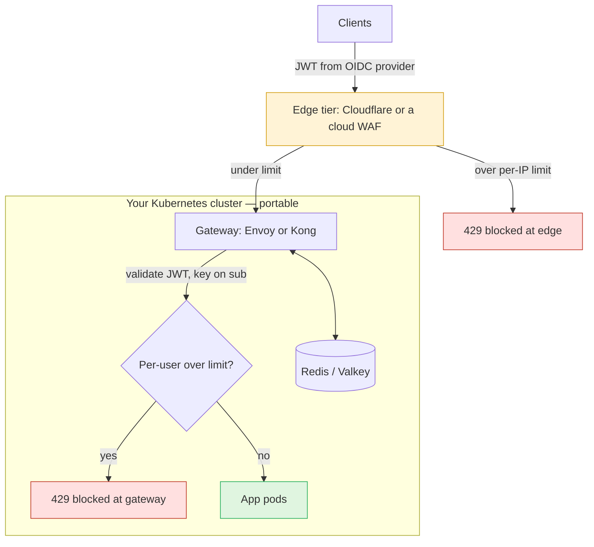
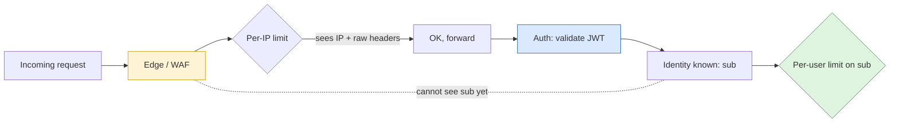
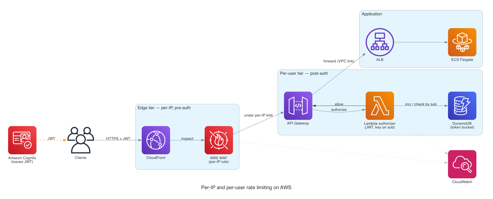

A while back I wrote about getting rate limited _by_ an external API. This post is the other side. It covers how we, a scaling startup, rate limit the traffic that hits our own API, and how we built it so that switching cloud providers later would mean changing the _implementation_, not redesigning the system.

When you are small you don't think about rate limiting at all. Then one of three things happens. A misbehaving client gets stuck in a retry loop and hits an endpoint thousands of times a minute. A scraper finds your public search endpoint and starts mirroring your catalogue. Or someone points a credential-stuffing script at your login route. Each time, your autoscaler tries to serve the flood, the bill creeps up, and real users get slower responses.

What changed recently is that the traffic isn't human anymore, and I think that makes rate limiting table stakes instead of a nice-to-have. For most of the web's history a single user generated sporadic, bursty, _slow_ load. Someone clicks, reads, thinks, and clicks again. A human can't issue more than a handful of requests a minute by hand. LLM-based agents broke that assumption. Now one user points an agent at your API, and the agent calls it in a tight loop, retries on every error, fans out into parallel sub-tasks, and runs unattended for hours. Per-user load went from a few requests a minute to hundreds, sustained around the clock. A single over-eager or buggy agent looks the same as an attack.

That matters more now because of where the cost lands. Every request an agent makes can trigger _metered_ spend downstream: more compute, more database load, and your own LLM inference bill if the endpoint calls a model. So an unbounded agent is a budget problem as well as a latency problem. It can run up a five-figure cloud bill overnight on legitimate credentials, with nobody doing anything malicious. With agents in the picture, per-user rate limiting is how you cap that spend. Most of the time you're protecting a feature from a well-meaning automated client that would bankrupt it by accident.

The naive fix is app middleware that checks a counter and returns a `429`. It works, but I learned the hard way that it has two problems. First, by the time your app counts the request, you have already paid for it. The connection was accepted and routed, a container woke up, and auth ran. Second, and worse, your app containers are a fixed resource that scales slowly. During a real flood, the existing containers get overloaded and fail their health checks long before new ones finish starting. The layer doing the rejecting is the layer that goes down.

So we don't reject in the app. We reject in two tiers _in front_ of it.

## Fix the architecture, swap the implementation

Staying cloud-agnostic doesn't mean finding one tool that runs everywhere. It means keeping the layers and their responsibilities constant and letting only the _implementation_ of each layer vary per cloud. Anything that speaks a standard protocol moves with you. Anything that's a proprietary cloud API ties you to that vendor.

There are two tiers, and the next section explains why the split is needed.

1. The edge tier applies coarse per-IP limits before authentication and drops floods cheaply before they reach your stack.
2. The per-user tier applies precise limits keyed on a stable user id, after authentication. It runs in an elastic gate _in front of_ your app, so the app fleet never absorbs the surge.



## Why per-user limiting can't live at the edge

This shaped the whole design. Your first instinct, and it was mine, is to authenticate the user, work out who they are, and rate limit per user right there at the edge. You can't, because of ordering.

**The edge security layer always runs before authentication.** The AWS docs say "WAF rules are evaluated before other access control features, such as resource policies, IAM policies, Lambda authorizers, and Amazon Cognito authorizers." The same holds for edge WAFs in general and for CloudFront's own functions. So when the edge evaluates a request, the user's identity doesn't exist yet. Auth happens later, downstream. The edge can only key on what the _client_ sends unprompted, which is the source IP plus raw headers, cookies and query values that it has no way to validate.



So the edge tier does what it _can_ do well, which is limiting by IP. The per-user tier lives after auth, where the identity is known.

## Tier 1: per-IP limits at the edge, before auth

This layer drops dumb floods. Every cloud has a managed WAF (AWS WAF, GCP Cloud Armor, Azure Front Door), and they're roughly equivalent in capability, which also makes them the easiest lock-in to fall into. To keep this tier independent of your _compute_ cloud, use an edge provider that sits in front of any origin, such as Cloudflare, Fastly or Akamai. Your origin can be on AWS today and GCP next year, and the edge config doesn't change.

Here's a per-IP rate limit on Cloudflare in Terraform:

```hcl
resource "cloudflare_ruleset" "edge_rate_limit" {
  zone_id = var.zone_id
  name    = "edge-ip-rate-limit"
  kind    = "zone"
  phase   = "http_ratelimit"

  rules {
    action      = "block"
    description = "Per-IP limit on the API"
    expression  = "(http.request.uri.path contains \"/api/\")"

    ratelimit {
      characteristics     = ["ip.src", "cf.colo.id"]
      period              = 60
      requests_per_period = 2000
      mitigation_timeout  = 60
    }
  }
}
```

Two things apply whatever the provider. First, roll new limits out in count/log mode and watch the metrics for a few days, because your legitimate power users get closer to the threshold than you'd guess. Second, scope each rule to the paths that need it instead of setting one global limit. Volumetric L3/L4 DDoS is the one thing you can't economically self-host, and that's why this tier stays with a vendor. Pick one that's independent of your compute.

## Tier 2: per-user limits on `sub`, after auth, in front of the app

After authentication you have a stable identifier for the user. Use the `sub` claim from the JWT your identity provider issues. Don't use the raw token, which rotates on every refresh and would give each user a fresh bucket. The identity provider is portable as long as it speaks OIDC. You can self-host Keycloak or Zitadel, or use a managed issuer that isn't tied to one cloud. Your gateway only reads a standard claim.

The enforcement point is a gateway, Envoy or Kong, that runs as containers in your own cluster in front of your app pods. This solves the overload problem. The gateway scales horizontally as its own deployment with its own HPA, so _it_ absorbs a surge instead of your fixed app fleet. The app pods only see traffic that has already passed the limit.

Kong is the low-ops option. Its JWT and rate-limiting plugins do this out of the box, and they keep shared state in Redis/Valkey so the limit holds across all gateway replicas:

```yaml
services:
  - name: api
    url: http://app.default.svc:8080
    routes:
      - name: api-route
        paths: ["/api"]
    plugins:
      - name: jwt # validates the JWT, resolves the consumer from it
      - name: rate-limiting
        config:
          minute: 300 # per authenticated user
          limit_by: consumer # the consumer is the authenticated identity (sub)
          policy: redis # shared state → correct across all gateway replicas
          redis:
            host: redis.default.svc
            port: 6379
          fault_tolerant: true
```

Envoy is the more powerful option. Its `jwt_authn` filter validates the token and extracts the `sub` claim. Its rate-limit filter then sends a descriptor keyed on that claim to the open-source `ratelimit` service, which holds the token buckets in Redis. It takes more wiring, but it's the standard choice for distributed rate limiting at scale. Either way, the state lives in Redis/Valkey, which speaks the same protocol on every cloud. Moving between ElastiCache, MemoryStore and Azure Cache is a connection-string change, not an architecture change.

> **Running this on AWS.** The same shape maps to AWS WAF for tier 1, plus a Lambda authorizer for tier 2 that validates the JWT and does a token-bucket check in DynamoDB before the request reaches your integration. It works and it's fully serverless. One gotcha is that API Gateway caches authorizer results, so you must set `authorizerResultTtlInSeconds = 0` or the counter won't increment on cached requests. The bigger catch is that it's the _most_ locked-in version, because a Lambda authorizer and DynamoDB don't move to another cloud. Envoy or Kong with Redis gives you the same architecture without the lock-in.



The two tiers map onto AWS services. CloudFront and WAF drop per-IP floods at the edge. The Lambda authorizer, keyed on the Cognito `sub` and backed by a DynamoDB token bucket, does the per-user limiting before a request reaches Fargate. The authorizer scales per request, so it absorbs a surge instead of your app fleet.

## The portability map

Switching clouds changes the right-hand columns, never the architecture:

| Layer            | Responsibility                  | Portable choice           | The lock-in version  |
| ---------------- | ------------------------------- | ------------------------- | -------------------- |
| Edge             | Per-IP, flood/DDoS, pre-auth    | Cloudflare / Fastly       | AWS WAF, Cloud Armor |
| Identity         | Issue JWT with stable `sub`     | Keycloak / Zitadel (OIDC) | Cognito              |
| Per-user gate    | Limit on `sub`, in front of app | Envoy / Kong (in k8s)     | Lambda authorizer    |
| Rate-limit state | Shared counters                 | Redis / Valkey            | DynamoDB             |
| Compute          | Run the stack                   | Kubernetes                | ECS/Fargate          |
| Observability    | Metrics on both tiers           | OpenTelemetry             | CloudWatch           |
| Infra-as-code    | Provision it all                | Terraform/OpenTofu        | CDK                  |

## The trade-off

You pay for portability in operations. Managed WAF, Cognito, Lambda and DynamoDB are close to zero-ops. Envoy, Redis and Keycloak are yours to run, patch and scale. For a three-person team that's a real cost. If you don't expect to move, using the managed AWS version behind Terraform modules is a reasonable choice. What you should _not_ do is bury cloud-specific assumptions in your request-handling logic. That's what turns a cloud migration from a config change into a rewrite.

The way I think about it, the edge keeps floods out, the gateway checks each user's limit, and the app only handles requests that got past both. Keep those three roles fixed and separate, fill each one with whatever the current cloud offers, and you get a lot of resilience plus the freedom to move. It costs you a couple of config files and the discipline to keep each layer to its one job.

More and more of your traffic now comes from automated agents that never pause to think, so the per-user check at the gateway isn't optional anymore. Without it, an agent-driven feature can wake you up with a budget alert at 3am.
