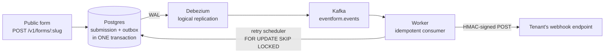
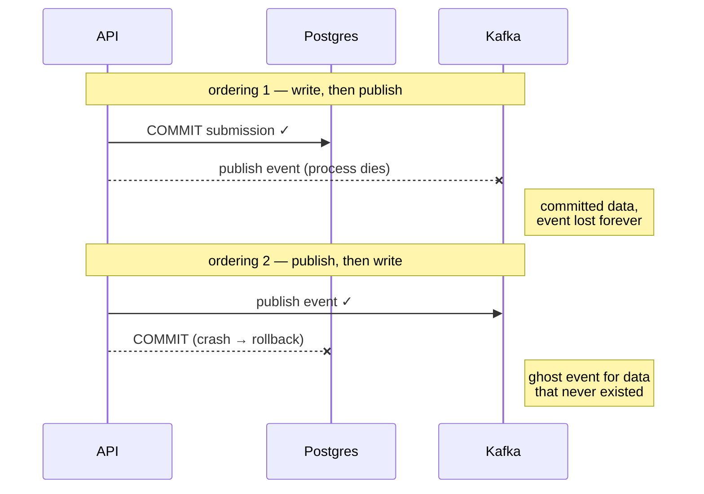
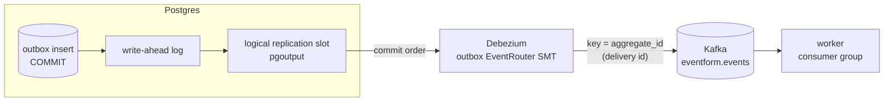
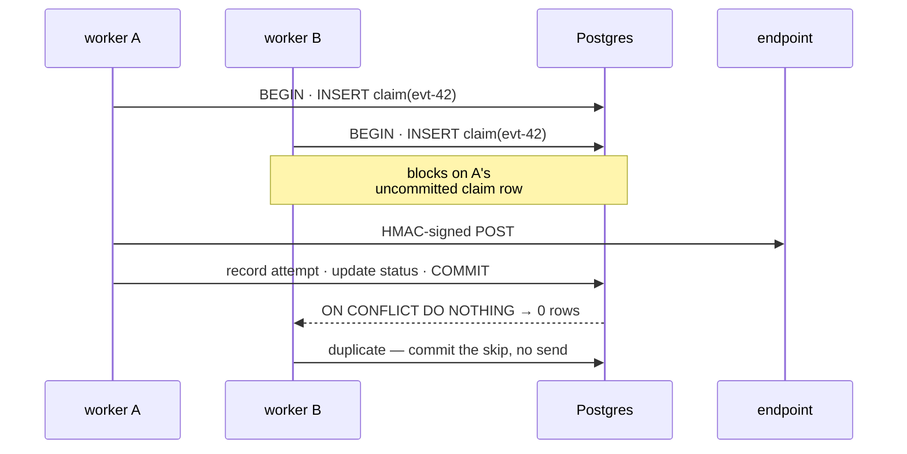
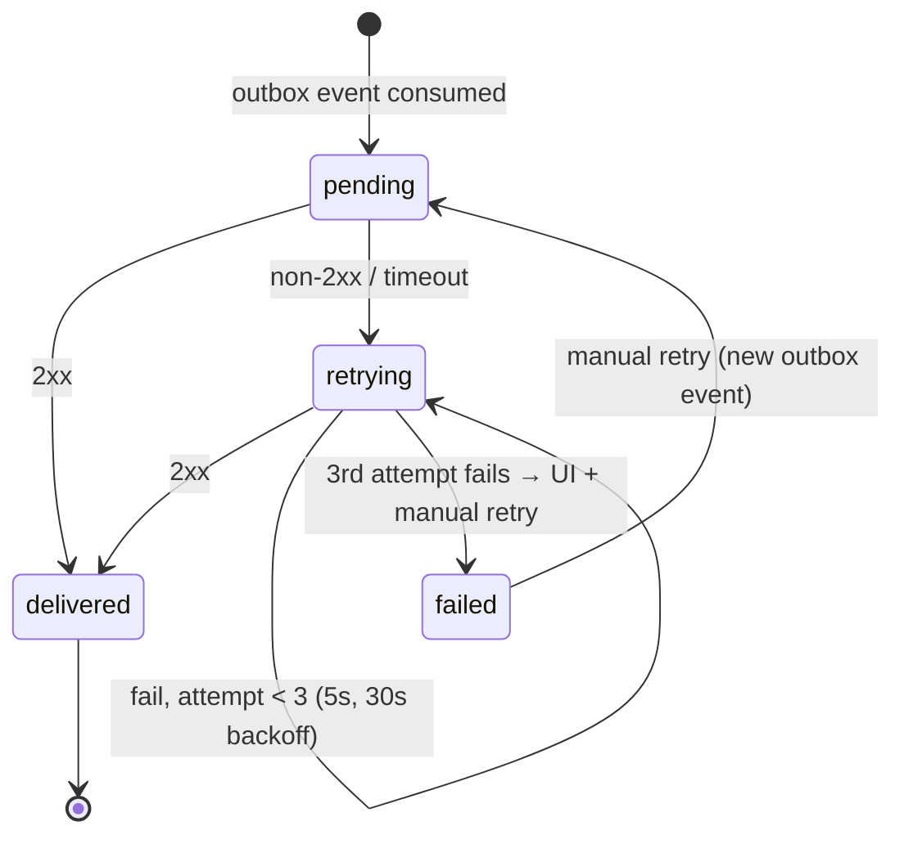
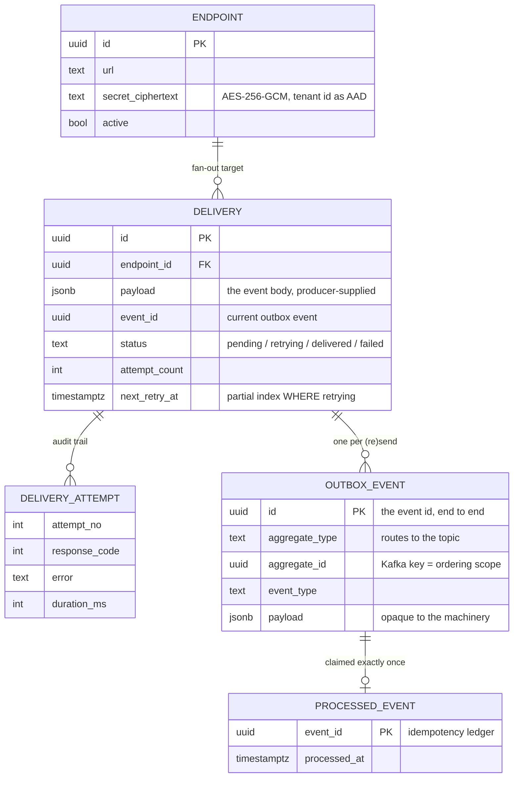
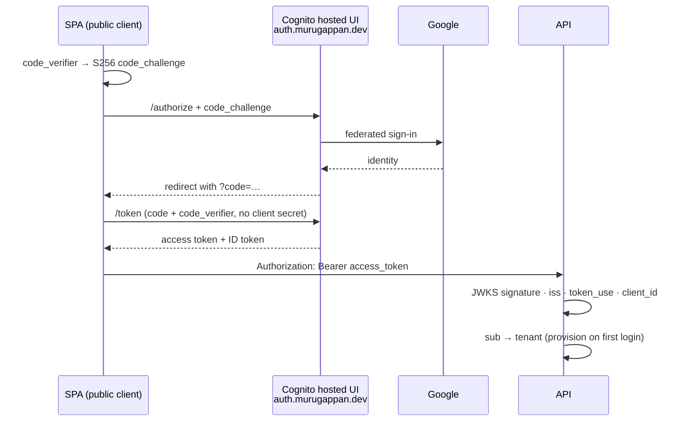

I wanted a portfolio project that wasn't another todo app, something anyone could click around in, built on the event-driven patterns I keep getting asked about in system design interviews. So I built [EventForm](https://eventform.murugappan.dev) ([source](https://github.com/murugu-21/eventform)), a mini-Typeform where every form submission fans out to webhook endpoints through a transactional outbox, Debezium CDC, Kafka and an idempotent consumer. The whole thing runs as a docker-compose stack on a single small AWS box, with Postgres on managed Neon and Cognito handling auth. Claude Code did most of the typing, and working that way taught me a few things of its own.

## The architecture



Someone submits a form. The API writes the submission, a `deliveries` row for each active endpoint, and an `outbox` row for each delivery, all in one Postgres transaction. Debezium tails the write-ahead log and pushes outbox inserts into a Kafka topic. A NestJS worker consumes them and delivers HMAC-signed webhooks. Failed deliveries retry with backoff and eventually show up in a UI with a manual retry button.

The "Kafka" here is Redpanda, a single-process, Kafka-API-compatible broker with no JVM. On a 2 GB box that footprint matters, and kafkajs and Debezium can't tell it apart from Apache Kafka. Everywhere I say Kafka below, I mean the wire protocol, not the JVM.

## Avoiding the dual write

My first instinct years ago would have been to write the submission to Postgres and then publish an event to Kafka. The problem is what happens when the process dies between those two writes. You either lose the event or you publish an event for data that never committed. You can reorder the writes, wrap things in try/catch or add a reconciliation cron. None of it closes the window. It only moves it. Both orderings fail, in opposite directions:



The transactional outbox pattern gets rid of the second write entirely. The event _is_ a database row, committed in the same transaction as the data it describes:

```text
BEGIN;
INSERT INTO submissions  (...);          -- the data
INSERT INTO deliveries   (...);          -- one per active endpoint
INSERT INTO outbox       (id, payload);  -- the event, id = event id
COMMIT;                                  -- all or nothing
```

There is no publish step to forget and no second system to fail. During review we tested this by revoking INSERT on the outbox table mid-request. The whole submission rolled back and left no partial state.

## CDC with Debezium

Something still has to move outbox rows into Kafka. The tempting answer is a poller, but polling adds latency and has its own missed-row edge cases. Change Data Capture reads the write-ahead log instead. Debezium connects to Postgres as a logical replication client and sees every committed outbox insert in commit order. Its outbox event router strips the envelope and produces only the payload to `eventform.events`. Messages are keyed by delivery ID, so all attempts for one delivery land in the same partition, in order.



Three config choices matter here. `pgoutput` is Postgres's built-in logical decoding plugin, so nothing gets installed into the database. `snapshot.mode=no_data` starts the connector streaming from the current WAL position instead of dumping the table first, because old outbox rows are history, not events to re-deliver. The slot's confirmed position advances only after Kafka acknowledges the write, so a connector crash replays from the last confirmed LSN. That makes delivery into Kafka at-least-once, the same contract the rest of the pipeline already has.

What surprised me when I traced the failure scenarios is that the replication slot makes Postgres itself the durability buffer. Postgres will not recycle WAL segments that the slot hasn't confirmed. So if Kafka goes down for an hour, nothing is lost. Submissions keep succeeding, WAL accumulates, and Debezium replays everything once Kafka is back. Kafka is only transport here, and the database stays the source of truth. The flip side is that a multi-day outage will pin WAL until your disk fills, so in real production you monitor slot lag.

## Exactly once\* (at least once)

The worker commits Kafka offsets only after it finishes processing, so the same message can be redelivered after a crash, a rebalance, or a deploy. To make redelivery safe, the worker claims each event in a ledger table. Where that claim goes is the part worth remembering. It's the first statement of the same transaction that does the work:

```sql
INSERT INTO processed_events (event_id) VALUES ($1)
ON CONFLICT DO NOTHING RETURNING event_id;
-- zero rows back = duplicate = skip without sending
```

Because the claim and the work commit or roll back together, they can never disagree. When two workers race on the same event, the second one blocks on the first's uncommitted insert and then sees the conflict, so exactly one webhook goes out. We tested that with two concurrent processors against a slow endpoint. The race looks like this:



This is why the claim must be an `INSERT` and not a `SELECT`-then-`INSERT`. The row-level lock on the uncommitted insert is what serialises the two workers. A read-check would let both proceed.

There is one boundary I can't engineer away. The HTTP send happens inside the transaction, so if the process dies between the send and the commit, the claim rolls back and the redelivery sends the webhook again. You can't atomically commit a database transaction and an external HTTP call. So it's at-least-once delivery with idempotent processing, and every webhook carries an `X-Eventform-Event-Id` header so receivers can dedupe. Stripe and GitHub offer the same contract. The landing page says "Exactly once\* (at least once)" and I mean both halves of it.

Retries work the same way. The auto-retry (5s, 30s, then dead) and the manual retry button don't get their own delivery mechanism. They insert a new outbox row and go through the same pipeline again, so there is one delivery path with one set of invariants. The retry scheduler claims due rows with `FOR UPDATE SKIP LOCKED`, so I could run multiple workers without a distributed lock. Two workers polling the same table grab disjoint rows. The poll is cheap because of a partial index, `ON deliveries (next_retry_at) WHERE status = 'retrying'`. It scans an index that only ever contains the in-flight retry set, not the whole table.

The full lifecycle of a delivery:



The same transaction that does the work also writes the transition. Every attempt, success or failure, leaves a `delivery_attempts` row with the response code, error and latency, and the deliveries UI renders those rows.

## Bigger than a PoC: events as a platform concern

EventForm is a proof of concept, but the same design works for any business that wants to emit events to its customers, the way Stripe, GitHub and Shopify webhooks do. What I'd pitch to a platform team is the separation of concerns.

Backend developers integrating with this pipeline have one job. They keep writing application state and add one outbox INSERT to the same transaction. They never touch Kafka, never think about retries or backoff, never learn what HMAC is, and never get paged because a customer's endpoint has returned 503 for an hour. Their failure domain ends at COMMIT.

Everything downstream is platform code, built once and shared by every event type. That covers CDC, the topic, the idempotent consumer, signing, retry scheduling and the failed-deliveries UI. Adding a new event to the catalogue takes a payload schema and an outbox insert, not a new delivery system. Because the database is the buffer, producers don't slow down or fail when consumers are down. The slowest customer endpoint in the world can't back-pressure a form submission.

Here is the delivery half of the schema on its own, which is the part a platform team would lift. It has no foreign key back into the domain. The producer hands the pipeline a payload when it creates the delivery, the delivery row stores it, and from then on the pipeline owns only the envelope:



The payload is opaque to everything downstream. When the pipeline re-emits an event, it rewrites the two envelope fields it owns, `eventId` and `attempt`, and never interprets the rest. Manual and scheduled retries both spread the stored payload into a fresh outbox row with a new envelope, with no joins back into producer tables. That's what makes it liftable. A payments team and a forms team could share this pipeline without it knowing either domain exists.

It didn't start out this clean. The first version kept a `submission_id` foreign key on deliveries and rebuilt the payload by joining `submissions` and `forms` on every retry. That worked, but it meant the "generic" pipeline secretly understood forms. I only noticed while writing this section. The fix was to store the payload and drop the FK, and it deleted more code than it added. The retry scheduler lost its joins, and its tests no longer seed any domain table.

## Handing off auth instead of owning it

This thing lives on the open internet. Scanners and credential-stuffing bots show up as soon as a domain resolves. Every tenant-facing route needs authentication, and I didn't want to own the risky parts of it: passwords, sessions and token lifecycles. So I delegated auth to Cognito, federating Google over plain OAuth 2.0:



The SPA runs the authorization-code flow with PKCE against Cognito's hosted UI on a branded `auth.` subdomain. PKCE means the SPA is a public client with no embedded secret. The API never sees a password and keeps no session state. It verifies the JWT's signature against Cognito's JWKS using `jose` and checks the issuer, `token_use` and client ID. That's the entire trust decision. A tenant gets provisioned on first login from the token's `sub` claim. The display name comes from the ID token after the code exchange, because Cognito's access token carries no profile data.

I put the verification behind a small `TokenVerifier` interface, so local development uses a dev-token implementation and production uses the Cognito one. The guard, tenant resolution and RLS are identical in both modes, so the production cutover was a config change rather than a code change.

In an interview I'd say authentication is the IdP's job, and my application only verifies signatures and maps `sub` to a tenant.

The one route that can't be authenticated is the public form itself. Anyone with the link should be able to submit, because that's the product. The same open-internet reasoning applies there, but the tool is per-IP rate limiting on the submission endpoint. A bot hammering a form link exhausts its own budget instead of flooding the pipeline with junk submissions and webhook fan-out.

## Letting Postgres enforce tenant isolation

Every tenant-scoped query runs inside a transaction that starts with `SET LOCAL app.tenant_id = $1`, and Postgres row-level security policies do the filtering. The API connects as a non-superuser role, so even if application code forgets a WHERE clause, the database refuses to return another tenant's rows.

Two RLS gotchas cost me real debugging time, and both pass every happy-path test:

1. After a transaction-local `set_config` commits, the session value on a pooled connection becomes an empty string, not NULL. So `current_setting(...)::uuid` throws on the next anonymous query that reuses the connection. Every policy needs `NULLIF(current_setting('app.tenant_id', true), '')::uuid`.
2. Permissive policies OR together. My "anonymous users can read published forms" policy leaked other tenants' published forms into logged-in sessions, because RLS takes the union of matching policies. It needed an explicit "only when no tenant is set" condition.

## Webhook integrity

Every delivery is signed with `HMAC-SHA256(secret, timestamp + "." + body)`, sent as an `X-Eventform-Signature` header. The timestamp is bound into the MAC so receivers can reject replays outside a tolerance window, and comparison is constant-time. Review caught a real bug here. `Number(timestamp)` accepts decimals, which let a signature minted for one timestamp/body split verify against a shifted one. The fix was a strict digits-only parse, a one-line change I would never have caught myself.

The signing secrets are never stored in plaintext. Each one is encrypted with AES-256-GCM, with the tenant ID bound in as additional authenticated data, so a ciphertext copied onto another tenant's row fails to decrypt. That gives me cryptographic tenant isolation on top of RLS. The cipher sits behind a small `SecretCipher` interface. Today it's an in-process AES-256-GCM implementation keyed from a 32-byte secret in the environment. Swapping in a managed, HSM-backed KMS such as AWS KMS or Vault for audited, rotatable keys would mean changing one class, and nothing above the interface would change.

## Scaling to zero between visitors

A portfolio demo that nobody is looking at most of the time shouldn't cost what a server running around the clock costs. So the box powers itself off when idle and wakes on the next visit. Every non-health request writes a timestamp to disk, and an on-box timer watches it. After 30 minutes of silence the instance sets its own Auto Scaling group to zero and terminates itself. Nothing is lost when it does. Postgres lives on Neon, and the only on-box state is the Redpanda log, which is disposable. This is the durability property from the CDC section again. Because the database is the source of truth and the replication slot replays anything in flight on the next boot, the compute is throwaway.

Waking back up is the half with a visible cost. The SPA is static on Cloudflare Pages, so the site itself never goes down. When it notices the API is unreachable, it POSTs to a small authenticated endpoint on API Gateway, which calls a Lambda that sets the desired capacity to 1 and launches a fresh box. The price is a cold start. The first visitor after an idle stretch waits two to three minutes while the instance boots, pulls about 3 GB of images and starts the pipeline. So instead of a spinner that looks broken, I show them what's happening and why, with a live progress estimate. Running this way costs a few dollars a month, which is the difference between leaving a demo up indefinitely and taking it down to save money.

## What working with Claude looked like

The workflow that worked for me went like this. I described what I wanted, and Claude interviewed me about the tenancy model, retry semantics and where row locks applied. Then it wrote a spec and broke the build into five phased plans. Each plan task went to a fresh agent, and every task got reviewed twice. One review checked "did you build what the plan said" and the other checked quality. The reviewers poked at the running system instead of only reading the diff.

That review loop earned its cost many times over. Besides the HMAC and RLS bugs above, it caught the worker crash-looping on a fresh deployment. The Kafka topic doesn't exist until the first event is produced, so the consumer's metadata fetch threw, a bug that only shows up on day one in production. It also caught CI booting the entire stack but never running migrations, so every test was hitting an empty database.

### The slop tax

I learned as much from the failures as from the wins. AI agents produce confident nonsense at a low but real rate, and in my experience it shows up in prose more than in code. My landing page claimed "5 retries" when the code does 3. The hero badge said "Phase 4 demo", internal planning jargon that leaked straight into customer-facing copy. The best one was the webhook-secret modal. It told users "shown once — store it now" while the Reveal button next to it would decrypt the secret on demand, any time. That copy was written for a hash-only security model and pasted onto a system I had built to be reveal-capable on purpose.

What I took away is that automated review checks behaviour thoroughly and doesn't check words at all. The tests proved the retry logic worked, but nothing fact-checked the marketing claim against `MAX_ATTEMPTS = 3`. Once I noticed, I ran one dedicated audit pass that found every factual claim in the UI and checked it against the code, and fixed every wrong one. If you ship AI-built products, budget for that pass. The code was rarely wrong. The copy was often wrong and always sounded sure of itself.

### What I'd keep doing

Tests against real services made the whole thing trustworthy. Every integration test hits live Postgres and Kafka and runs the real AES-256-GCM cipher, with no mocks. When an agent claimed something worked, a green suite against real infrastructure backed the claim. Plans written as executable documents, with exact file paths and actual code blocks, kept agents on track, and agents reported deviations instead of improvising silently. I also kept the design decisions for myself, such as outbox over dual-write and Cognito over hand-rolled auth, and spent most of my attention being suspicious of everything else.

The final count is 163 tests, plus a Playwright run that signs in, builds and publishes a form, submits it anonymously and checks that the webhook arrives. I can defend the pipeline's delivery guarantees line by line. Claude typed fast, and my job was to read what it wrote.
