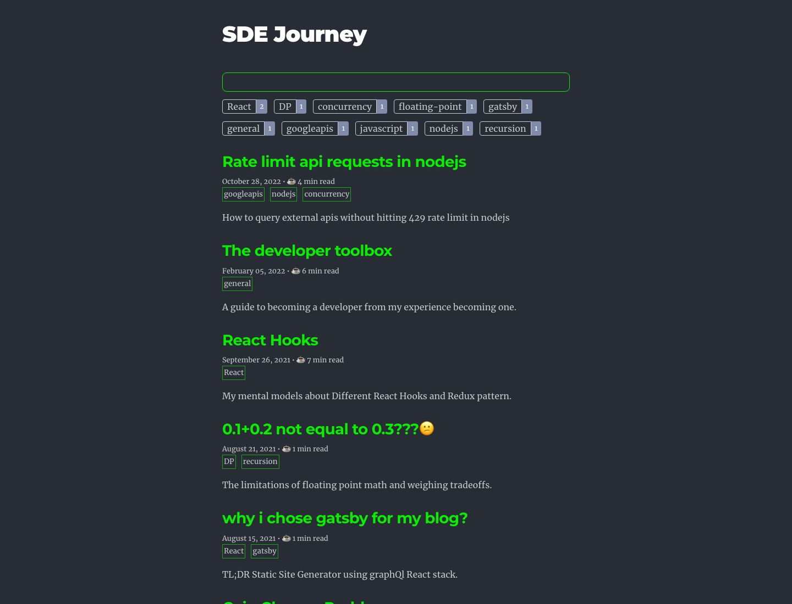
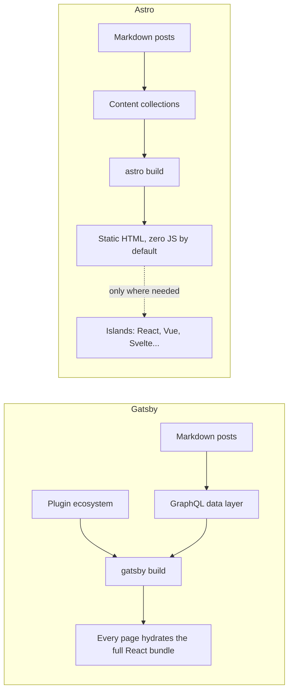
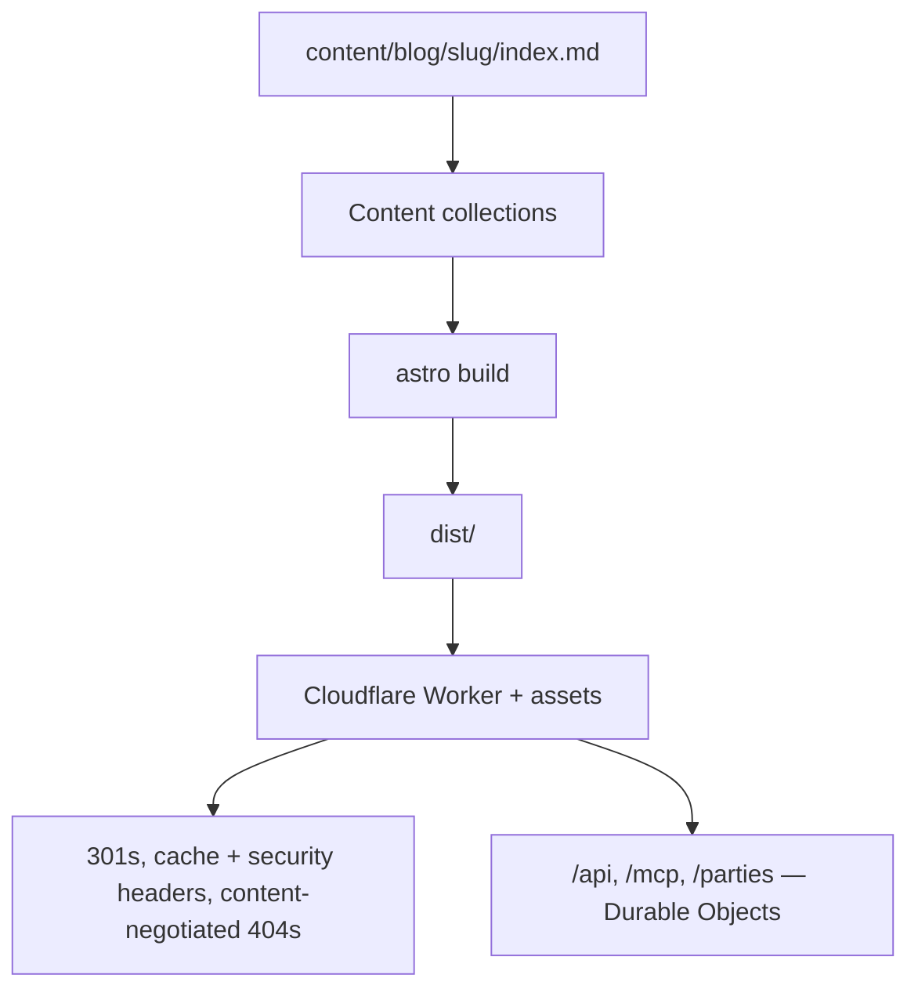
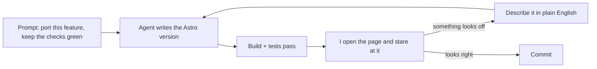
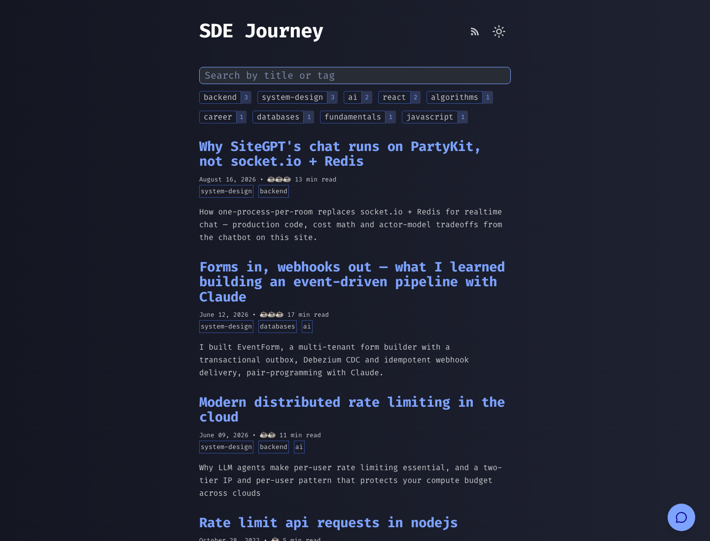

Back in 2021, I wrote about [why I chose Gatsby for my blog](https://murugappan.dev/blog/gastby/). Five years later, this site runs on Astro. Here's why I switched, and everything that broke on the way.

## State of Gatsby

Gatsby was [acquired by Netlify](https://www.netlify.com/press/netlify-acquires-gatsby-inc-to-accelerate-adoption-of-composable-web-architectures/) in February 2023, and active development on the framework stopped shortly after. [Gatsby Cloud got folded into Netlify Cloud](https://www.netlify.com/blog/gatsby-cloud-evolution/) that August, the core contributors moved on, and most plugin maintainers abandoned their plugins. The framework isn't formally dead. `npm install gatsby` still works, patches still trickle out, but the ecosystem around it is unmaintained, and the [community discussion](https://github.com/gatsbyjs/gatsby/discussions/39062) has been going in circles for two years.

For a nine-post blog you can ignore all that for a while. What pushed me over wasn't a dramatic break, it was a small one: a dependency bump that surfaced a plugin issue nobody was ever going to fix. I'd rather spend a weekend on a migration than a weekend on archaeology.

## Why Astro

I first heard about Astro from [this Fireship video](https://www.youtube.com/watch?v=dsTXcSeAZq8), around the same time I was picking Gatsby. What I liked then is what I liked now: [islands architecture](https://docs.astro.build/en/concepts/islands/). Zero JavaScript by default, hydrate only the parts that need it, use React (or Vue, or Svelte) for those parts when you actually need to. The old blog shipped a React bundle on every page to render a list of links and a search box. That's a lot of machinery for content.

There were smaller reasons. Markdown posts as content collections instead of a data layer. Typed frontmatter, one folder per post, nothing in between. And GraphQL is on the death path. My day job is actively migrating away from it to good old REST APIs, and I wasn't going to keep a GraphQL layer alive just to render markdown files.

## Why now, and why Cloudflare

The hosting story goes back further than the framework story. I had already moved off GitHub Pages a while earlier. Back in college I did not have the money to buy a domain, and by the time I did I bought `murugappan.dev` on Cloudflare because they sell domains at cost with no renewal markup. When I tried to point it at GitHub Pages, I found out the apex-domain setup wants [hardcoded IPv4 addresses](https://docs.github.com/en/pages/configuring-a-custom-domain-for-your-github-pages-site/managing-a-custom-domain-for-your-github-pages-site) in your DNS. After four years in B2B SaaS and an unreasonable amount of DR testing and reports, hardcoded IPs are a personal red flag, so the blog went to Cloudflare as well.

Then the ecosystem made the decision for me. Cloudflare [acquired Astro](https://astro.build/blog/joining-cloudflare) in January 2026, then [VoidZero](https://blog.cloudflare.com/voidzero-joins-cloudflare) — Vite, Rolldown, Oxc, Vitest — that June. PartyKit, which runs the chat on this site, [joined](https://blog.cloudflare.com/cloudflare-acquires-partykit) back in 2024. The VoidZero announcement landed five days before I started the migration; the framework, its build tooling and the platform it all runs on were suddenly under the same roof. At that point I was 100% onboard. My CSP was backing the project, and that was definitely going to develop deployment synergies.

Two weeks later I upgraded to Astro 7 and got Vite 8 + Rolldown as a direct side effect. Synergies indeed.

The other reason I was confident: this kind of migration has gotten cheap thanks to coding agents. It's the ideal problem for them. Nothing novel, a lot of grunt work, and every step verifiable against the site that already exists. Anthropic showed this at absurd scale when they [rewrote Bun from Zig to Rust](https://bun.com/blog/bun-in-rust): 535,000 lines in 11 days for an estimated $165,000 in API tokens. Sure, the code the agents write might not be top notch, but at least it works.

## The migration

I didn't start by prompting "port my blog". First I had the agent write a parity plan: everything the Gatsby site did, 24 features from image optimization to the offline service worker, each one mapped to its Astro equivalent. Then we ticked them off one at a time, a build and a browser pass after each. [The plan is still in the git history](https://github.com/murugu-21/murugu-21.github.io/blob/8f1310d/blog/docs/superpowers/plans/2026-06-10-gatsby-to-astro-migration.md) if you want the full checklist. It's a decent template for this kind of port.

The condensed version:

| Gatsby did it with                                                 | Astro does it with                                                                                                                 |
| ------------------------------------------------------------------ | ---------------------------------------------------------------------------------------------------------------------------------- |
| `gatsby-source-filesystem` + `createFilePath` for slugs            | Content collections with a glob loader, slug = folder name                                                                         |
| Draft posts hidden in production, visible in dev                   | A filter on the entry id in production                                                                                             |
| React page + `AllPosts` for search, tags, reading time             | React island at first; plain Astro components and ~30 lines of JS now                                                              |
| `gatsby-remark-images`                                             | Astro's built-in image pipeline                                                                                                    |
| `gatsby-remark-prismjs`                                            | `markdown.syntaxHighlight: "prism"`, same PrismJS theme                                                                            |
| `gatsby-remark-autolink-headers`                                   | `rehype-slug` + `rehype-autolink-headings`, same SVG                                                                               |
| `gatsby-remark-smartypants`                                        | Astro's built-in smartypants                                                                                                       |
| `gatsby-browser` + a webpack `__name` shim for mermaid             | A dynamic `import("mermaid")` on pages that need it                                                                                |
| `gatsby-ssr` `setPreBodyComponents` for the pre-paint theme script | The same inline script, first thing in `<body>`                                                                                    |
| Gatsby components + `StaticImage` for the bio and toggle           | React islands with plain `` tags                                                                                              |
| `react-helmet` for the SEO head                                    | `BaseHead.astro`                                                                                                                   |
| `gatsby-plugin-feed`                                               | `@astrojs/rss` + markdown-it and sanitize-html                                                                                     |
| `gatsby-plugin-sitemap`                                            | `@astrojs/sitemap`, one sitemap for the whole site                                                                                 |
| `gatsby-node` `onPostBuild` for `llms.txt`                         | An `llms.txt` route                                                                                                                |
| `gatsby-plugin-manifest`                                           | A static `manifest.webmanifest`                                                                                                    |
| `gatsby-plugin-offline`                                            | Offline caching dropped; the manifest stays, so the site is still installable, and a self-destroying `sw.js` evicts the old worker |
| `gatsby-plugin-gtag`                                               | The gtag snippet inline in the head                                                                                                |
| `typeface-*` font packages                                         | `@fontsource` imports                                                                                                              |
| GitHub Pages publish workflow                                      | Cloudflare Pages, later Workers + static assets                                                                                    |

The blog moved into this repo next to the portfolio, one build command produced both sites, and 301s kept the old URLs alive. Halfway through I also folded both apps into a single Astro project, so now there's one build, one deploy, one sitemap, and `/blog` comes from where a file sits instead of a `base` config. That part had its own bugs, covered below.

One more file before the bugs: `sw.js`. The old site used `gatsby-plugin-offline`, so anyone who had visited before had a service worker busy caching the Gatsby build. Skip the eviction and those visitors keep getting the old site forever, no matter what you deploy. The new `sw.js` is ten lines. It unregisters itself on activate and reloads any open tabs. Easiest file in the migration to forget.

Worth being precise about what got dropped, since I got it wrong myself at first: the offline cache, not the installability. The new site doesn't register a service worker at all, so there's no offline mode, but the manifest and icons are still there and you can still install it as an app. [Chrome stopped requiring a service worker for installation](https://developer.chrome.com/blog/update-install-criteria) a while back, so the manifest is what matters.

## The bugs

The port itself took about a day. The next few weeks went into making it not embarrassing. This is the part I actually want written down, because "the agent did it" is only half the story. It can keep a build green and pass tests, but it can't see, and a blog is a visual product. Every visual regression here was caught by me opening a page and staring at it.

The bug list, straight from the commit log (links go to the fixes):

| What broke                                                                  | Why                                                                                                                                                                                                     | Fix                                                                                                                                                    |
| --------------------------------------------------------------------------- | ------------------------------------------------------------------------------------------------------------------------------------------------------------------------------------------------------- | ------------------------------------------------------------------------------------------------------------------------------------------------------ |
| Post tables lost all their styling                                          | The rules lived in Gatsby's stylesheet and never made it into the port                                                                                                                                  | [7cca589](https://github.com/murugu-21/murugu-21.github.io/commit/7cca589)                                                                             |
| Clicking an image in the react post landed on a 404                         | Gatsby-era `` self-links — Astro hashes the `` but the anchor stayed a raw relative path, and the zoom handler didn't `preventDefault`                               | [383afad](https://github.com/murugu-21/murugu-21.github.io/commit/383afad)                                                                             |
| Zoom grabbed the author avatar and the social icons                         | The selector was page-wide instead of scoped to the article                                                                                                                                             | [006315d](https://github.com/murugu-21/murugu-21.github.io/commit/006315d)                                                                             |
| Mermaid diagrams couldn't be zoomed                                         | The SVGs live behind blob URLs, and zoom only understood ``                                                                                                                                    | [c070a3e](https://github.com/murugu-21/murugu-21.github.io/commit/c070a3e)                                                                             |
| Every image was broken in RSS readers                                       | `content:encoded` kept post-relative `src="react.jpg"`, and feed readers render the body detached from the post directory                                                                               | [cf2606b](https://github.com/murugu-21/murugu-21.github.io/commit/cf2606b)                                                                             |
| The theme toggle disappeared, console full of React error #130              | `react-toggle` is CJS-only; moving the component under a `"type": "module"` package flipped the default import to the whole `module.exports` object, so React got an object where a component should be | [4c7fdc1](https://github.com/murugu-21/murugu-21.github.io/commit/4c7fdc1)                                                                             |
| Your theme choice reset when you crossed between the blog and the portfolio | The blog persisted a `theme` string, the portfolio an `isDark` JSON boolean                                                                                                                             | [cb767e5](https://github.com/murugu-21/murugu-21.github.io/commit/cb767e5)                                                                             |
| Every missing `/blog/<url>` showed the portfolio's 404                      | Astro only treats a top-level `404.astro` as the status page, so the blog's 404 never built to the path Cloudflare walks up to                                                                          | [1085bbe](https://github.com/murugu-21/murugu-21.github.io/commit/1085bbe), [b525b45](https://github.com/murugu-21/murugu-21.github.io/commit/b525b45) |
| Half the redirects missed                                                   | Cloudflare Pages matches paths exactly — `/slug` and `/slug/` are two different rules                                                                                                                   | [0589222](https://github.com/murugu-21/murugu-21.github.io/commit/0589222)                                                                             |
| A formatter rewrote code inside six published posts                         | `semi: true` in the merged config formatted the JavaScript inside markdown fences                                                                                                                       | [135124a](https://github.com/murugu-21/murugu-21.github.io/commit/135124a)                                                                             |
| Local build green, CI red with `MissingSharp`                               | Astro's image service needs `sharp`; my `node_modules` had cached optimized images and the build image had none                                                                                         | [3717f3e](https://github.com/murugu-21/murugu-21.github.io/commit/3717f3e)                                                                             |
| The blog index still shipped React                                          | `AllPosts`, `TagBar` and `SearchBar` were Gatsby leftovers                                                                                                                                              | [2d5bee7](https://github.com/murugu-21/murugu-21.github.io/commit/2d5bee7)                                                                             |
| Web fonts shifted the whole layout on load                                  | No font-metric fallbacks                                                                                                                                                                                | [967f0e7](https://github.com/murugu-21/murugu-21.github.io/commit/967f0e7)                                                                             |
| Every `git push` died with exit 254                                         | The pre-push hook still ran `npm --prefix blog`, and `blog/` didn't exist anymore                                                                                                                       | [1085bbe](https://github.com/murugu-21/murugu-21.github.io/commit/1085bbe)                                                                             |
| Returning visitors would have been stuck on the old site                    | `gatsby-plugin-offline` had registered a service worker at the old origin                                                                                                                               | the self-destroying `sw.js`                                                                                                                            |

Three of them are worth more detail.

**The 404 that wasn't.** Astro only special-cases a top-level `404.astro`, so the blog's 404 page built to `dist/blog/404/index.html`, and Cloudflare's `not_found_handling` walks up to the nearest `404.html`, which didn't exist under `/blog/`. Every missing blog URL quietly served the portfolio's 404 instead. No build error, no failing test, nothing in `astro check`. The file was there, just not where the platform looks. The fix emits `dist/blog/404.html` as well. And then I made the build fail if the copy doesn't contain the blog's title marker. That little assertion turned out to be the most useful thing this migration produced: the same regression came back a month later during the consolidation, and this time the build stopped it.

**The vanishing theme toggle.** The toggle rendered as a blank spot and the console threw React error #130. `react-toggle` is a CJS-only package, and its default export changes shape depending on the module type of the importing file. The component used to sit under `blog/package.json`, which had no `type` field, so the bundler gave us the class. Consolidating moved it under the root `package.json` with `"type": "module"`, which switches on Node's real ESM-from-CJS rules, and the default import became the whole `module.exports`, an object. React got `{__esModule: true, default: Toggle}` where a component should have been. The fix was one unwrap at the import site. Finding it was the expensive part.

**The images that 404'd on click.** Markdown from the Gatsby era wraps images in a link to the image file itself: ``. Gatsby left that link alone. Astro optimizes the `` into a hashed asset under `_astro/`, but the anchor's `href` stayed a raw relative `react.jpg`, which resolves to `/blog/react/react.jpg`, a file that is never emitted. So clicking an image followed a dead link, because the zoom handler didn't `preventDefault`. I dropped the wrapper links and made the handler bail out when an image sits inside an anchor, so the same markup in a future post zooms instead of navigating.

Everything else in that table was the same story in miniature: the checks were green and the page was wrong.

## Where it landed

| Page          | Mobile before the perf pass | Mobile after |
| ------------- | --------------------------- | ------------ |
| Blog index    | 98                          | 100          |
| React post    | 96                          | 100          |
| PartyKit post | 96                          | 99           |

Desktop is 100 everywhere. The index ships zero React now — the list, the tag chips and the search box are plain Astro components plus maybe thirty lines of inline JS. For reference, the 2021 post's bragging right was 90+ on mobile, over a much simpler site.

If you're just here to read, not much changed. Old post URLs 301 to `/blog/<slug>/`, with and without the trailing slash. The feed is at `/blog/rss.xml`. The posts themselves didn't move. That was the whole point of the parity checklist: a migration, not a redesign.

## Would I do it again?

Yes, no question. This is the shape of work agents are good at: the destination is known, there's a test suite to lean on, and the middle is grunt work. What they can't do is look at the result. I found every visual bug in this post by opening a page and describing what looked off, in plain English, and the worst one, the 404, couldn't be seen at all until I checked the thing I least wanted to check.

I did hit a lot of visual bugs and had to verify and re-prompt a lot, but overall I am very happy with the result, and I couldn't have done this in this much time without AI.

## References

- [Netlify acquires Gatsby Inc.](https://www.netlify.com/press/netlify-acquires-gatsby-inc-to-accelerate-adoption-of-composable-web-architectures/) — February 2023
- [Netlify on the Gatsby Cloud evolution](https://www.netlify.com/blog/gatsby-cloud-evolution/) — August 2023
- [“Is GatsbyJS officially dead?”](https://github.com/gatsbyjs/gatsby/discussions/39062) — the long-running community thread
- [The Astro Technology Company joins Cloudflare](https://astro.build/blog/joining-cloudflare) — January 2026
- [VoidZero is joining Cloudflare](https://blog.cloudflare.com/voidzero-joins-cloudflare) — June 2026
- [Cloudflare acquires PartyKit](https://blog.cloudflare.com/cloudflare-acquires-partykit) — April 2024
- [Rewriting Bun in Rust](https://bun.com/blog/bun-in-rust) — the scale of what agents can port
- [Astro islands architecture](https://docs.astro.build/en/concepts/islands/) — the actual docs
- [Fireship on Astro](https://www.youtube.com/watch?v=dsTXcSeAZq8) — where I first heard about it
- [This site's source](https://github.com/murugu-21/murugu-21.github.io) — the migration, bugs and fixes included
