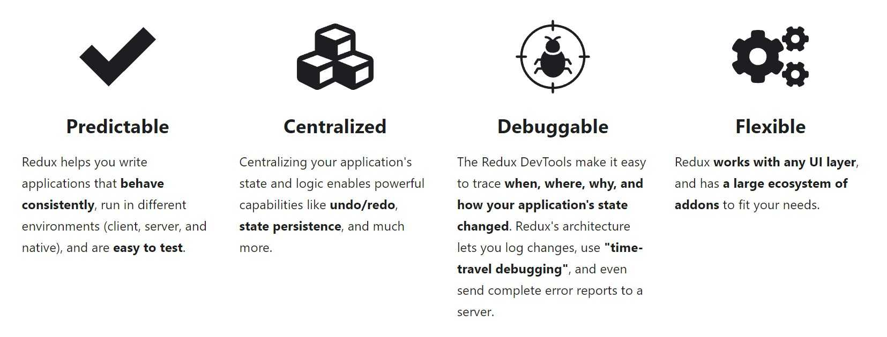
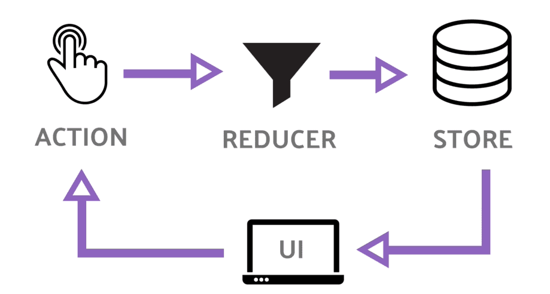

## History of the web

The web was initially all about static documents meant to act as a sort of indexed library of the world. It still is, but the introduction of javascript by netscape and subsequent performance improvements by firefox(gecko) and chrome(V8) made it possible to build super interactive dynamic websites that for most people replaced the need to develop and support desktop apps for different OSes. This also meant that a lot of R&D money from internet companies like Facebook, Google went into making the web a better place. Today, even desktop apps are built using electron, which is basically a browser and server patched into a app. The development of nodejs (again thanks to V8) has resulted in js being used even in the backend/server part of applications.

## JavaScript

Back in 1995, Brendan Elich, a Netscape engineer, put together the initial version of JavaScript in 10 days as a additional nice to have feature for their flagship browser. But it became so popular that all browser vendors accepted js as a standard. This hacky initial version meant that js was inherently bad in design, but nobody wanted to break existing websites in their browser. Since a new language was ruled out, people started adding new syntax and nice paradigms to existing js and a lot of transpilers were created to compile better designed languages to js.

Since adding new features to js is a painful process as it has to be accepted as a standard by all vendors, companies came out with different frameworks/libraries as a better approach to tranpsilers. In 2013, facebook came out with a js library called React which changed the framework landscape with a new and innovative paradigm(more below). Frameworks like Angular, Vue changed their approach to web development after React became so popular.

## React

[](react.jpg)

Javascript is imperative in changing state of components. Below is a simple example of incrementing counter value on button click.

```html
<!DOCTYPE html>
<html>
  <body>
    <div id="number"></div>
    <input type="button" onclick="incrementValue()" value="Increase" />
    <script>
      var value = 0
      document.getElementById("number").innerHTML = value //imperative - you have to manually set initial state to ui
      function incrementValue() {
        value++
        document.getElementById("number").innerHTML = value //imperative - you have to manually update the ui on stateChange
      }
    </script>
  </body>
</html>
```

React essentially does the last part for you. Whenever you change state variables related to UI, you call setState instead of direct assignment and React renders The UI again to match current state.

```jsx
import React, { Component } from 'react';
class App extends Component {
    state = {
      count: 0
    };
    render() {
        return (
            <div>
                {this.state.count}
                <button onClick={()=>{this.setState(this.state.count + 1)}}>
            </div>
        );    }}export default App;
```

This syntax of combining js and html is called JSX, Babel compiles this template to pure js and react ships a runtime to handle setState during runtime. JSX and React allows us to render our UI as a set of reusable components each with their own conatined state and events. This makes our code declarative - this means much more maintainable and readable code as far as UI is concerned.

## Hooks

In 2019, React library was updated with hooks to make code more readable(less verbose) and minimise components size. Here’s the same example using hooks.

```jsx
import { useState } from "react"
export default function App() {
  const [value, setValue] = useState(0)
  return (
    <div>
      {value}
      <button onClick={() => setValue(value + 1)}>increment </button>
    </div>
  )
}
```

useState is a hook which takes in initial value as parameter and returns state variable and setState. This results in clean setState functions where you don’t have to copy the whole state to change some of it and rewrite the whole state again in setState(essentially reducing code size).

### useContext

This is all fine for one component. But in the real world apps are going to have hundreds of components and when you need a state change in one component to trigger UI changes in another, It get incredibly messy. Before context, you would need to hold all state in parent component and pass down state as props to all dependent children. This can make your parent component huge(1000s of lines huge) and involve a lot of boiler plate code. We can use createContext and useContext hooks as syntactic sugar to make this a lot easier.

App.js

```jsx
import { createContext, useState } from "react"
import CustomButton from "./customButton"
export const stateContext = createContext()
export default function App() {
  const [value, setValue] = useState(0)
  return (
    <StateContext.Provider value={{ value, setValue }}>
      {value}
      <CustomButton />
    </StateContext.Provider>
  )
}
```

customButton.jsx

```jsx
import { useContext } from "react"
import { stateContext } from "./App"
export default function CustomButton() {
  const { setValue } = useContext(stateContext)
  return <button onClick={() => setValue(value + 1)}>increment </button>
}
```

### useEffect

The next problem comes when you have to fetch data from a database and load to UI. fetch is asynchoronous, which basically means that it might take a long time to execute and your UI will be frozen if done synchronously. Hence, you use useEffect with empty array as dependency (since fetch only occurs once after loading) to update UI. What fetch does is that it makes a request to a external api and lets the event loop run. When response is received, code inside then() is added and executed as a microtask (when event loop reaches end).

```jsx
import { useState } from "react"
export default function App() {
  const [value, setValue] = useState(null)
  useEffect(() => {
    fetch("/api/getvalue").then(res => setValue(res))
  }, [])
  //empty dependency array ensures only one execution after initial render
  return (
    <div>
      {value}
      <button onClick={() => setValue(value + 1)}>increment </button>
    </div>
  )
}
```

useEffect is also very useful when you have state or UI changes or cleanup dependent upon state change of another value(useLayoutEffect is better suited for synchronous code that need to be run before paint). In general, remember this, useEffect runs after state of any dependency array values has changed.

### useReducer

[](redux.jpg)

This hook can be used with useContext to follow the redux pattern.

[](redux-pattern.png)

- **store** - global state variable containing state of whole application.
- **action** - state can be changed only by despatching a action.
- **reducer** - pure function that takes state, action as input and returns next state. Here pure function means that state is immutable(state object is not directly changed by function, rather a completely new state is returned with corresponding changes.)
- **dispatch** - takes in action object and calls the reducer with current state.

The useReducer hook takes reducer, initial state as arguments and returns current state, dispatch. This is very similar to useState, but here we extract the logic to change state to a reducer function and only dispatch actions. This makes our code DRY, easier to debug and improves performance by avoiding callbacks. React bails out of rerendering the children or firing effects if same value is returned by reducer. Lets look at the same counter example using redux pattern.

App.js

```jsx
import { createContext, useReducer } from "react"
import CustomButton from "./customButton"
export const stateContext = createContext()

const initialState = { value: 0 } // store initial value

const reducer = (state, action) => {
  switch (action.type) {
    case "increment":
      return {
        ...state,
        value: state.value + 1,
      }
    default:
      throw new Error()
  }
}

export default function App() {
  const [state, dispatch] = useReducer(reducer, initialState)
  return (
    <stateContext.Provider className="App" value={dispatch}>
      {state.value}
      <CustomButton />
    </stateContext.Provider>
  )
}
```

customButton.js

```jsx
import { useContext } from "react"
import { stateContext } from "./App"
export default function CustomButton() {
  const dispatch = useContext(stateContext)
  return (
    <button onClick={() => dispatch({ type: "increment" })}>increment </button>
  )
}
```

Based on the complexity of your application and features you want to implement. redux pattern can either seem like needless boilerplate (for small apps without a lot of shared state between components) or the best design decision you ever made (for large apps with a lot of shared state between components that needs to be debugged every week or so and has to meet a lot of performance metrics). Basically if you are making a blog with react, you will never need redux. But if you are building the next facebook or twitter with huge teams involved in development, redux will save you a lot of effort and time. check out [this article](https://medium.com/@dan_abramov/you-might-not-need-redux-be46360cf367) by the creator of Redux.

If you are just begining to learn react, I suggest you try out your idea using the methods mentioned here [thinking in React](https://reactjs.org/docs/thinking-in-react.html).

If you want to delve deeper into the hooks api, checkout [react-hooks](https://reactjs.org/docs/hooks-reference.html).
