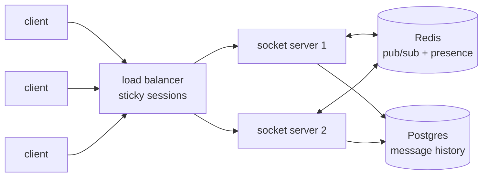
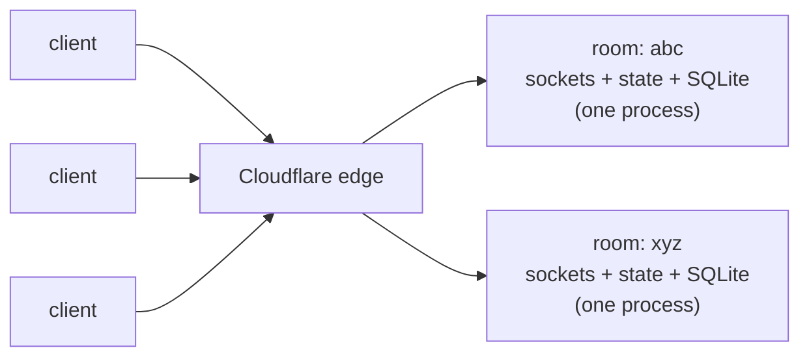
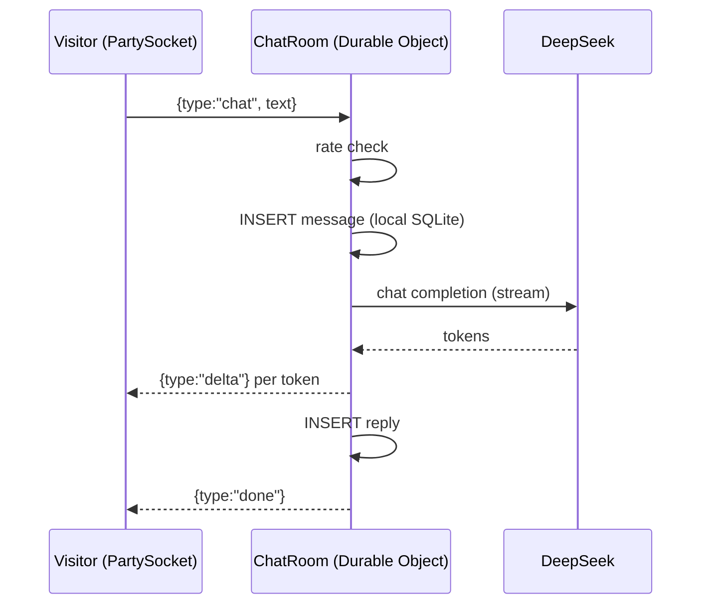

[SiteGPT](https://sitegpt.ai)'s founder [Bhanu Teja](https://x.com/pbteja1998) spent months trying to solve a realtime sync problem. His product is a chatbot trained on your website, and it needed one feature that turned out to be hard. When the bot gets stuck, a human agent should be able to join the same conversation live, with the visitor, the bot and the agent all seeing the same messages at the same time. That's a classic multiplayer problem.

His testimonial on [partykit.io](https://www.partykit.io/) tells the ending. He'd "tried everything and nothing seemed to work properly," until [Sunil Pai](https://x.com/threepointone), PartyKit's creator and a former React core team member, solved the whole problem in around ten lines of code.

The difference between months of work and ten lines was architecture, not talent. Sunil's ten lines treated the chat room as a place, not as a routing problem. Give the room its own process, memory and address, and most of the hard realtime problems go away.

I read that story, went down the rabbit hole, and ended up shipping the same architecture for the chatbot on this site. This post covers what I learned: how the default socket.io + Redis stack works, what the room-as-a-process model replaces it with, the production code, the real costs, and where the old way is still the right choice, because an architecture post shouldn't be a sales pitch.

## The default stack

If you ask for "scalable websocket chat" in a system design interview, you'll get some version of this:



And the canonical implementation:

```js
import { Server } from "socket.io"
import { createAdapter } from "@socket.io/redis-adapter"
import { createClient } from "redis"

const pub = createClient({ url: REDIS_URL })
const sub = pub.duplicate()
await Promise.all([pub.connect(), sub.connect()])

const io = new Server(httpServer, { adapter: createAdapter(pub, sub) })

io.on("connection", async socket => {
  const { roomId } = socket.handshake.query
  socket.join(roomId)

  // History lives in Postgres, presence in Redis, the socket on this box
  socket.emit("history", await db.messages.findMany({ where: { roomId } }))
  await pub.hSet(`presence:${roomId}`, socket.id, Date.now())

  socket.on("chat", async text => {
    await db.messages.create({ data: { roomId, text } }) // history → Postgres
    io.to(roomId).emit("chat", text) // fanout → Redis
    // presence, typing, receipts: same split, every feature
  })
})
```

Nothing here is wrong. But look at what you've built. The state of one room is spread across three systems. The sockets live on whichever servers the load balancer picked. Presence lives in Redis. History lives in Postgres. Every feature now spans at least two of them, whether it's typing indicators, read receipts, rate limits or "agent joined the chat", and keeping them coordinated is your job. You need sticky sessions so reconnects land on a predictable server, pub/sub so server 1 can reach a socket on server 2, and cleanup jobs for the presence hashes that leak when a server dies mid-connection.

In effect, you're building a distributed system whose only job is to simulate what a single machine per room would give you for free.

So why not have a single machine per room?

## The room is the server

Cloudflare's Durable Objects are built on that idea. So is PartyKit, which made the model easy enough to use that it caught on. PartyKit has since joined Cloudflare. This site uses [partyserver](https://github.com/cloudflare/partykit/tree/main/packages/partyserver), its open-source successor library, which is maintained inside the PartyKit monorepo.

A Durable Object combines three guarantees:

1. **One instance, globally.** Ask for the object named `room-abc` from anywhere on Earth and you get the same instance. The room ID is the address, not a lookup key. You don't need sticky sessions or a session registry, because the platform handles routing.
2. **Single-threaded execution.** A room processes one message at a time. Redis has strong atomic commands. `INCR` has always been atomic, and Redis 8.4 added compare-and-set variants of `SET`. But each is one specific command, and you design your logic around it. Inside a room, arbitrary multi-step code that reads, branches and writes across SQL tables is race-free exactly as written.
3. **Storage in the same process.** Each object gets its own private SQLite database, stored on the same machine that runs its code. Reading history is a synchronous local query, not a network hop to a database that might disagree with your cache.



Compare the two diagrams. The second one isn't simpler because I hid boxes. It's simpler because the boxes no longer need to agree with each other. This is the actor model. A process owns its state and behavior, and other code reaches it by name. The idea is forty years old. Erlang built a telecom empire on it, and I'll come back to that.

## The production code

Everything below is trimmed from the actual worker that runs the "Chat with Jarvis" widget on this site. The [full source is on GitHub](https://github.com/murugu-21/murugu-21.github.io), and the whole backend, including the LLM plumbing, is about a thousand lines.

The room, using partyserver:

```ts
import { Server, type Connection } from "partyserver"

export class ChatRoom extends Server<Env> {
  static options = { hibernate: true }

  onStart() {
    // This room's private database. Not a schema shared with every room —
    // a whole SQLite file that belongs to this one conversation.
    this.ctx.storage.sql.exec(
      `CREATE TABLE IF NOT EXISTS messages (
         id INTEGER PRIMARY KEY AUTOINCREMENT,
         role TEXT NOT NULL,
         content TEXT NOT NULL,
         created_at INTEGER NOT NULL
       )`,
    )
  }

  onConnect(connection: Connection) {
    // Reconnect, new tab, returning visitor — history is a local read.
    this.send(connection, { type: "history", messages: this.history() })
  }

  async onMessage(connection: Connection, raw: unknown) {
    const msg = parseClientMessage(raw)
    this.persist("user", msg.text)

    // Stream an LLM reply token-by-token down the same websocket
    const reply = await runModelExchange(this.env.AI, this.messages(), delta =>
      this.send(connection, { type: "delta", text: delta }),
    )

    this.persist("assistant", reply.content)
    this.send(connection, { type: "done" })
  }
}
```

This is the real code minus error handling and a few one-line helpers. `persist`, `history` and `send` wrap SQL statements and `connection.send`. `onConnect` replays history with a synchronous local query. `onMessage` persists, streams, then persists again, and because the room is single-threaded, nothing can interleave between those steps.

And here's the entire client-side session layer:

```ts
import { PartySocket } from "partysocket"

const socket = new PartySocket({
  host: window.location.host, // same Worker serves the static site
  party: "chat-room",
  room: roomId(), // a nanoid in localStorage. That's it. That's the session.
})

socket.send(JSON.stringify({ type: "chat", text }))
// PartySocket buffers sends while (re)connecting — no dropped messages
// during the connect window, no readyState bookkeeping in app code.
```

One message, end to end:



Notice what's missing. There's no session store, no pub/sub hop, no presence hashes leaking when a server dies holding open sockets, and no logic for which server owns a socket. Features that each took a section to explain in the old architecture are single lines here, because everything the room needs is inside the room.

## What "scalable" means here

The scaling story is easy to get wrong, so I'll be precise. This model scales out by room count, not by room size.

A million concurrent conversations means a million small, independent processes spread across Cloudflare's fleet, with no coordination between them. Nothing is shared, nothing needs rebalancing, and there's no hot Redis channel. Scale-out is free in the direction chat grows, which is the number of conversations.

Within one room, the ceiling is real. Single-threaded execution means one very hot room can only do what one process can do, and the practical answer for enormous rooms is sharding them across several objects. You won't hit that limit with conversations, support chats, docs or lobbies, where a room has anywhere from one to thousands of participants. For a broadcast to 500k viewers, this is the wrong model. More on that below.

The cost comparison cuts both ways. Serverless is cheap only at low and spiky utilization, and you pay a premium per unit of compute for that elasticity. The estimates below use Cloudflare's published rates and ballpark list prices for a VM stack. They assume an AI chat like this site's, where the room stays awake about 2 seconds per message while the LLM streams. Read the last rows as carefully as the dollar rows, because for a small team they matter most.

|                                          | socket.io + Redis                                                                                                      | Workers + Durable Objects                                                                     |
| ---------------------------------------- | ---------------------------------------------------------------------------------------------------------------------- | --------------------------------------------------------------------------------------------- |
| Cost, small scale (up to ~100k msgs/day) | ~$60/mo floor for VMs, Redis, LB and Postgres, running even at zero traffic                                            | ~$0–10/mo; this site's chatbot fits in the free tier                                          |
| Cost, ~1M msgs/day                       | ~$150–200/mo                                                                                                           | ~$105/mo, mostly duration                                                                     |
| Cost, sustained 10M+ msgs/day            | ~$300/mo; dedicated hardware wins clearly here                                                                         | ~$1,500/mo, as the elasticity premium compounds                                               |
| Idle nights and spiky days               | full price, 24/7                                                                                                       | ~zero, because `hibernate: true` parks idle rooms while the platform holds their sockets open |
| Ops burden                               | the real bill, since patching, scaling, failover, monitoring and on-call across four systems add up to a part-time job | `wrangler deploy`, and Cloudflare handles on-call                                             |
| Time to first production deploy          | days to weeks of plumbing before the first feature                                                                     | the room class above is the backend                                                           |

The dollar crossover sits somewhere past a million messages a day. For plain human-relay chat it's much further out, because those rooms are awake for milliseconds, not seconds. The LLM assumption drives most of that $1,500. Below serious sustained scale, the money difference is small next to the ops row. One stack needs an operator and the other doesn't. Past that scale, dedicated hardware wins on unit price and you can afford the operator. That's one reason WhatsApp runs its own Erlang fleet instead of renting actors by the GB-second.

## When socket.io + Redis is still the right answer

Here's the test I'd give a design interview candidate. Is your realtime problem a noun or a feed?

Rooms, documents, auctions, game lobbies and device twins are nouns. Each is a bounded set of clients interacting with a thing that has state. Nouns fit actors.

Tickers, scoreboards and notification firehoses are feeds. They have an arbitrary subscription topology, or they send one identical stream to a huge audience. Feeds fit brokers. Prefer the traditional stack when:

- **Subscription topology is a matrix, not a room.** A dashboard client subscribing to 50 instrument feeds at once is the case pub/sub was built for. One actor per ticker forces awkward fan-in.
- **One stream, hundreds of thousands of watchers.** A broadcast is N sends on the room's single thread, and at tens of thousands of sockets you'd be hand-building fanout trees. Stateless socket servers reading from one Redis channel are the right architecture there. A hybrid works too, with an actor as the source of truth publishing into a broadcast layer for spectators.
- **You already run the infra.** A team fluent in Redis with a k8s estate and on-prem requirements should not adopt a new execution model to ship a chat widget.
- **Polyglot backends.** socket.io speaks every language. Durable Objects run JavaScript on workerd.
- **Heavy CPU per message.** Workers have tight CPU budgets. A transcoding pipeline doesn't belong in a room actor.

Durable Objects also have two caveats that vendor posts skip. First, an object lives where it was first created. A room created in Chennai answers from roughly Chennai forever, which is perfect when participants are nearby and slower when they're not. Second, the debugging and observability tools are years behind what socket.io + Redis operators have built up over a decade.

## You're adopting a model, not a vendor

The uncomfortable question is whether this just trades Redis for a deeper kind of Cloudflare lock-in.

What settled it for me is that you're adopting the actor model, and it's the most battle-tested architecture in messaging. WhatsApp is built on it, a cluster of Erlang nodes where every connection is its own lightweight process with its own state, and messages go from process to process with no external broker. Each server holds roughly a million connections, and the service has two billion users. When WhatsApp crossed nine hundred million users, it famously had a team of about fifty engineers. Durable Objects didn't invent the pattern. They made it rentable by the millisecond.

One clarification before a commenter makes it for me. WhatsApp's actor is the connection, a process per user, with group messages fanning out into per-recipient queues. Durable Objects make the room the actor. It's the same model with a different boundary. Rooms suit web chat, where the conversation itself has shared state such as history, presence and budgets. Connection actors suit per-recipient delivery guarantees at WhatsApp's scale. Picking the boundary your problem needs is the design skill.

Because it's a model and not an API, the portable move is to keep your domain logic behind a small interface:

```ts
interface RoomActor {
  onConnect(conn: Conn): void
  onMessage(conn: Conn, data: unknown): Promise<void>
  broadcast(data: unknown, exclude?: string[]): void
  storage: RoomStorage // co-located, transactional, private to this room
}
```

Everything interesting in this site's chat, including persistence, rate budgets, LLM streaming and lead capture, is written against that interface. Today partyserver implements it. If I ever needed to move, partyserver and workerd, the Workers runtime itself, are both open source and self-hostable. The same interface also maps almost mechanically onto an Elixir/Phoenix channel backed by a GenServer per room, which is the boring, decades-proven way to build the same idea. The vendor owns the transport and the placement. You own the model.

## It runs on this page

I didn't write this from a benchmark lab. The architecture in this post runs the chat widget in the corner of this page. It's a grounded LLM concierge with streamed replies, persistent per-visitor conversations, rate budgets and email lead capture. I took it to production in a weekend, it deploys with one command, and it runs on the free tier.

Open the widget and say hi to Jarvis. You'll be talking to a Durable Object, one small single-threaded room that owns everything it needs. Then read [the source](https://github.com/murugu-21/murugu-21.github.io) and count the pieces of infrastructure you didn't have to deploy.

If your realtime problem is room-shaped, give each room its own process. You'll ship in days instead of months and run almost no infrastructure. Because you're adopting the actor model rather than one vendor, you can still move later.
