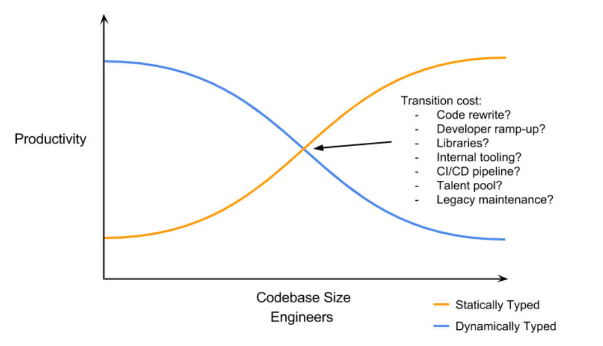
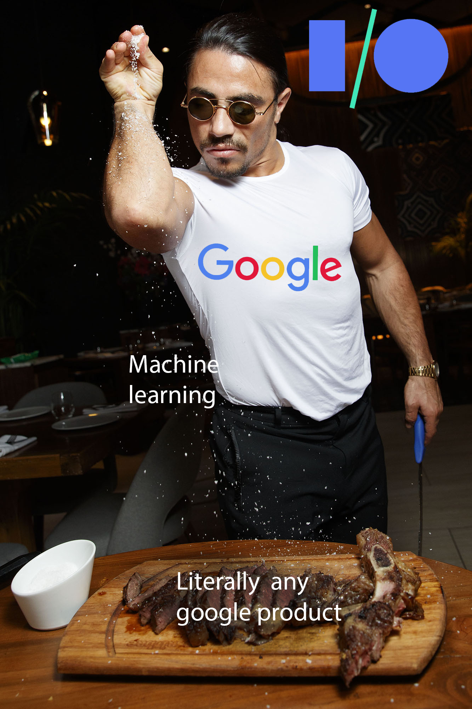

## A Language

The next tool is learning any mainstream language. This is covered well by most uni's. I beleive learning python/js at first will really hurt the Developer experience(Dx) for most people because eventually you will run into concepts like types, pointers, classes and compilation. Then, you will hate these because you know small projects can be done without them and start hating them when you accidentally chose java or c++ for your project. But ultimately, all real world projects are huge scale and relay on these concepts to be sure their system works and can be compartmentalized and reused. All though there is a lot of debate in the community around dynamic vs static typing, I prefer static for all projects and dynamic for any small(like really small) works. even then, It could become a liability quicker than you think. This ismple graph kind of nails it all.

> I recommend learning C first(only the very basics of it with pointers and structs) . Then learn any OOPS language (I prefer kotlin, but even typescript is great) and data structures in C (not OOPS). then learn python/js as a quick to prototype model.

## 

## The world of huge codebases

I believe a CS degree really lays a solid foundation to become a developer except in one huge area. All projects/lab software that we write in uni tend to be one file programs to at best a few hundred lines of code for an app and often are written individually or by a few people using one copy of the codebase.

In the real world of software development, almost no project is like this. All projects have thousands of lines of code and are simultaneously worked on by teams of people. So, the first tool you need to be very familiar with is git. 

The best way to do this is by contributing to open-source projects. find a platform you are interested in (web, mobile, ml etc) and find small scale projects with issues open in github. use "Good First issue" label and find a issue to contribute to. fork the project, clone to your remote machine. Often you will find guidelines on how to fix, if not try to google around for possible approaches. once you verify all tests are running in local environment with your modified code, make a commit and push to your github repo. from there, open a pull request(pr) with a description based on template provided. The maintainers will guide you through and ask for any changes needed, make them commit and repeat till they approve and merge your pr. **Congratulations!!** you have contributed to open source and learned your first lesson on working with highly distributed huge scale development of software. this is how its done in the real world.

> I am also a undergrad in CS in my 3rd year and until very recently, I too hadn't worked with pr's. I feel this should be thought in uni alongside git during sophomore before we are asked to do projects (typically 3rd year).

## 

## Test Driven Development (TDD)

The best quote i heard on TDD was:

> "Unit tests are like vegetables. you hate eating(writing) them, but they ensure you(codebase) stay healthy"

Unit tests do exactly what the name suggests, they ensure a unit (class, function etc) work as you intended them to. TDD philosophy can be applied for developing any feature in three steps.

1. Write a test for the feature and run to see it fail

2. write enough code to make the test pass

3. refactor for more readability/separation of concerns.

This is great for the psychology of the developer also as seeing a green validation of their work increases morale.

## Database

The moment you need to persist something over restarts and time, you need a database. Relational databases are the most popular and prove enough for a wide range of application upto medium scale. However, for large scale and niche scenarios like chat data, you will need nosql. The major nosql paradigms are:

1. key-value pair - great for caching ex: Redis

2. Column-Oriented - great for time series and indexing ex: BigTable

3. Document Based - Best sql replacement ex: MongoDB

4. Graph Database - best for graph (friends relation, roads) ex: neo4j

Just know the basics of all and learn mongoDB and sql in depth.

## UI/UX

My suggestion here is learn basics of html/css/js and one declarative composable framework like react/vue/angular (I prefer React with functional components(Hooks)). These modern frameworks have moved away from the traditional imperative model and popularised ui as function of state (again for reducing bugs in large scale projects).

The mobile world has also warmed up to the idea with jetpack compose(Android) and swift ui(ios). So it would be great if you learned these trends. checkout my guide on [React Hooks](https://murugu-21.github.io/react/). 

This will also make you learn about rest-api's and a bit of microservices as you write to implement the backend of your app and try to make it communicate with your frontend app.

## Deployment

signup for aws, add a credit card and deploy your project in a ec2 instance with s3 for assets like images and a database. This is the best way you can learn how deployment works.

Docker is a way to package your application in a provider agnostic way. Kubernetes is used to scale your application up and down based on traffic. These are the new trends of cloud, learn the basics of them and play around with a linux distribution. you must be good to go.

## Machine Learning(ML)

Thanks to [Moore's Law](https://en.wikipedia.org/wiki/Moore's_law), Both computing power and memory capacities have grown considerably over the past 5 decades. This has lead to a burst in the amount of data collected and analyzed by people over the years. The culmination of all this is neural networks, they are mathematical models which roughly simulate our brain's neurons to form connection among datasets and expected outputs.

Python is the defacto language of ML. Tensorflow(Google) and pytorch(Facebook) are the two most popular neural networks libraries. Try to understand the basics of these even if you don't intend to work in this space because ML has become a key part of all organizations operations and chances are you are going to be asked to integrate a model into your product one day or another. The idea that your app can understand the world around it is pretty exciting to think about. This is going to result in a lot of innovative app ideas.

Also, If you are interested, this is the most paid field in the industry because its so new and there are very few people with PHD's who can perform competently. Laws of demand and supply apply everywhere. However, The work is very much different from software development and requires multi domain knowledge of statistics, sql, specific domain knowledge of problem etc. All ML projects are also essentially R&D projects but most managements don't understand this and pressure for output especially considering the pay of people involved and hardware costs(Oh yes!, all AI/ML research are super compute/memory intensive and require specialized hardware like NVIDIA GPUs and TPU/NPUs). So consider these factors before jumping all in or starting a startup around ML.

## Conclusion

Overall, its a great time to become a developer and I beleive this guide helped you understand the path to become one. Its a wild world out there, with patience and years of hard work and a bit of money, you will be able to put together any task assigned to you/any tech startup you want to make.

Remember, non-technical people thinks its all possible in a day and will ask you do magic with your app. stay away!!!

 
